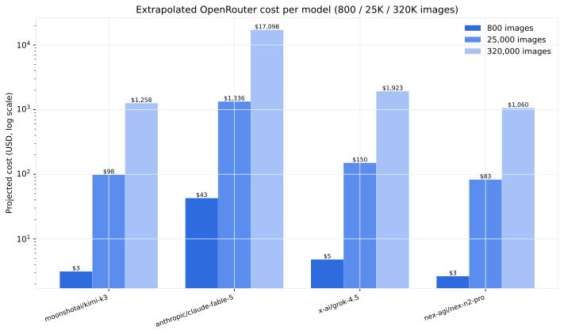

## The shape of the cost curve

Every model's per-image cost was measured by running one document through the
classifier and recording the actual token counts and `usage.cost` from the
OpenRouter response. The projection below scales that linearly to three
production workloads: a full 800-image sweep, a 25,000-image batch, and a
320,000-image production run.

## Projected cost by model (USD)

| Model | 800 images | 25,000 images | 320,000 images |
|-------|-----------:|--------------:|---------------:|
| `nex-agi/nex-n2-pro` | $2.65 | $82.82 | $1,060.08 |
| `moonshotai/kimi-k3` | $3.14 | $98.28 | $1,257.98 |
| `x-ai/grok-4.5` | $4.81 | $150.21 | $1,922.69 |
| `anthropic/claude-fable-5` | $42.74 | $1,335.75 | $17,097.60 |

At 320,000 images the cheapest model (`nex-n2-pro`) is over 16× cheaper than the
most expensive (`claude-fable-5`).

## How the numbers were measured

The estimates come from `estimate_openrouter_cost.py`, which sends one real image
through the model, records `prompt_tokens`, `completion_tokens`, and the billed
`usage.cost`, then extrapolates linearly. They are **measured, not list-price
guesses** — but they are single-sample measurements and should be read as
order-of-magnitude guidance.

### Measured usage (single image)

| Model | Prompt tokens | Completion tokens | Billed (per image) |
|-------|--------------:|------------------:|-------------------:|
| `moonshotai/kimi-k3` | ~12,000 | ~20 | ~$0.0039 |
| `anthropic/claude-fable-5` | ~5,300 | ~6 | ~$0.0534 |
| `x-ai/grok-4.5` | ~2,950 | ~53 | ~$0.0060 |
| `nex-agi/nex-n2-pro` | ~13,200 | ~5 | ~$0.0033 |

The per-image cost is dominated by **prompt tokens** — the 1024×1024 image plus
the long v17.2-era instruction text — so models with aggressive prompt caching
or cheap input tokens win the scale-up comparison.

## What the production runs actually billed

The projections above use list-price extrapolation. The Braintrust experiments
record what OpenRouter actually billed per row, and reality is cheaper than list
price thanks to prompt caching:

- **v11.8 @ 1,120 images** — billed **$0.4937** actual vs $0.6815 list-price
  expected (+27.5%), averaging **$0.000441/image**. ~63% of prompt tokens were
  cache hits billed at ~10% of input price.
- Extrapolating the *billed* number: **$0.35** for 800, **$11.02** for 25,000,
  **$141.07** for 320,000 — about a 3.5× discount vs the list-price projection
  for `qwen3.7-flash`.

See the [cost estimation](../cost/cost-estimation.qmd) page for the raw
measurement log and the experiment log for each run's billed totals.
