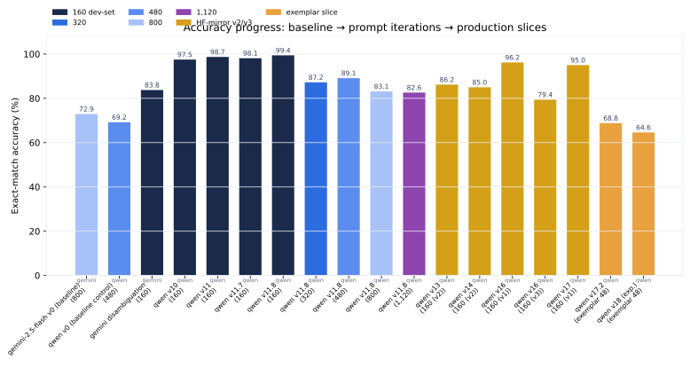

::: {.hero}
<div class="hero-title">RVL-CDIP Document Classifier</div>

<div class="hero-subtitle">
A prompt-engineering lab over the RVL-CDIP benchmark. Vision language models on
OpenRouter classify scanned documents into 16 types — with 27 versioned prompt
iterations, exact-match evals on Braintrust, cost tracking per image, and a
4,641-row Monte Carlo study of robustness, ensembling, routing, and early-stop
behavior.
</div>

<div class="hero-badges">
<span class="badge">16 document classes</span>
<span class="badge">27 prompt versions</span>
<span class="badge">v17.2 default prompt</span>
<span class="badge">99.4% best slice accuracy</span>
<span class="badge">OpenRouter + Braintrust</span>
</div>
:::

::: {.stat-grid}
::: {.stat-card}
<div class="stat-value">99.4%</div>
<div class="stat-label">Best slice accuracy — prompt v11.8 on the 160-image balanced set</div>
<div class="stat-foot">v11.8 · fixed_size_sampled · qwen3.7-flash</div>
:::
::: {.stat-card}
<div class="stat-value">82.6%</div>
<div class="stat-label">v11.8 on 1,120 held-out images (925 / 1,120) across three splits</div>
<div class="stat-foot">1600_balanced_1120 slice</div>
:::
::: {.stat-card}
<div class="stat-value">27</div>
<div class="stat-label">Versioned prompt iterations, from baseline v0 to v17.2</div>
<div class="stat-foot">append-only changelog in the repo</div>
:::
::: {.stat-card}
<div class="stat-value">4,641</div>
<div class="stat-label">Monte Carlo corpus rows across 1,512 images and 14 experiments</div>
<div class="stat-foot">ablation · ensemble · routing · failure pipeline</div>
:::
:::

## At a glance

The project turns the classic RVL-CDIP document-classification benchmark into a
controlled prompt-engineering study. Each scanned document is rendered to a
1024×1024 grayscale PNG, sent to an OpenRouter vision model with a versioned
classification prompt, and scored on **exact-match** accuracy against the
16-class vocabulary. Every run lands in Braintrust as a reproducible experiment,
and results flow into this site as charts generated from the committed data.

```text
RVL-CDIP scan ──► 1024×1024 grayscale PNG ──► OpenRouter vision model ──► 16-class prediction
                        ▲                              │                          │
                   versioned prompt                   reasoning trace        exact-match score
                  (v0 → v17.2)                           + runner-up           + cost → Braintrust
```

Models evaluated include `qwen3.7-flash`, `qwen3.5-35b-a3b`, `gemini-2.5-flash(-lite)`,
and `kimi-k3`. The default prompt, **v17.2**, ships a 14-check verification cascade
and a self-critical reasoning scratchpad.

::: {.section-grid}
::: {.section-card}
<div class="section-card-title">Headline results</div>
<div class="section-card-desc">Per-class accuracy, the accuracy arc from baseline to production slices, and the three failing classes.</div>
:::
::: {.section-card}
<div class="section-card-title">Experiment log</div>
<div class="section-card-desc">Every Braintrust eval: accuracy, tokens, errors, cost projections, and prompt-version notes.</div>
:::
::: {.section-card}
<div class="section-card-title">Confusion matrices</div>
<div class="section-card-desc">Heatmaps for every run — the recurring letter→memo, budget↔invoice, and *→form story.</div>
:::
::: {.section-card}
<div class="section-card-title">Prompt evolution</div>
<div class="section-card-desc">The v0→v17.2 changelog: what changed, why, and the accuracy each version earned.</div>
:::
::: {.section-card}
<div class="section-card-title">Monte Carlo analysis</div>
<div class="section-card-desc">Prompt ablation, ensemble voting, routing &amp; abstention, early-stop words, and verification behavior.</div>
:::
::: {.section-card}
<div class="section-card-title">Cost analysis</div>
<div class="section-card-desc">Measured per-image cost for each model, extrapolated to 800 / 25,000 / 320,000 images.</div>
:::
:::

## The accuracy arc

From the 72.9% Gemini baseline to v11.8's 99.4% on the 160-image slice — and the
honest fall-off on larger, harder slices (87.2% @ 320, 83.1% @ 800, 82.6% @ 1,120).



| Dataset slice | Images | Best version | Accuracy |
|--------------:|-------:|--------------|---------:|
| fixed_size_sampled (v1) | 160 | v11.8 | **99.4%** |
| fixed_size_sampled (v3/v4) | 160 | v16 | 96.2% / 79.4% |
| fixed_size_sampled_v2 | 160 | v13 | 86.2% |
| fixed_size_sampled_320 | 320 | v11.8 | 87.2% |
| fixed_size_sampled_480 | 480 | v11.8 | 89.1% |
| rvl_cdip_800 | 800 | v11.8 | 83.1% |
| 1600_balanced_1120 | 1,120 | v11.8 | 82.6% |

Explore the [headline results](results/headline-results.qmd) for per-class
breakdowns and the failure analysis behind these numbers.

## Project layout

This site is generated by two scripts that read the committed documentation and
reports — no API keys needed:

- `scripts/site/build_site_charts.py` — parses committed markdown tables and
  renders every chart on this site as SVG
- `scripts/site/build_site.py` — rewrites the source docs into Quarto pages,
  repairs log corruption, and builds the aggregate + appendix pages

Everything upstream (evals, dataset slicing, report generation) lives in the
[GitHub repository](https://github.com/Exios66/AMFAM_capstone).
