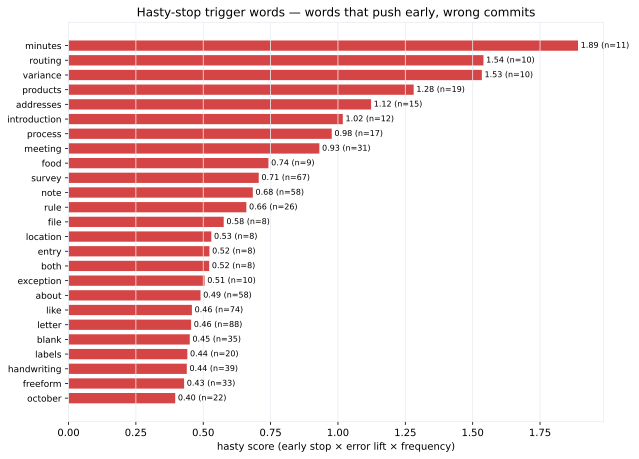

- **Corpus rows**: 1913 (reasoning-covered)
- **Traces parsed into checks**: 1832
- **Traces with an explicit stop**: 1301
- **Baseline stop position**: 9.4 of 14 checks
- **Overall error rate**: 17.1%

## ALE (Accumulated Local Effects)

ALE of each reasoning feature on the probability of a correct label, computed with 20 quantile bins and a 200-draw bootstrap. A rising curve means more of the feature is associated with higher accuracy; a falling curve means it is associated with error. Because ALE averages out correlated features locally, the curves isolate each feature's own effect rather than the raw marginal trend.

*ALE curves — chart not reproduced on the site; see `reports/monte_carlo/` in the repository.*

## Hasty-stop trigger words

Words below are quoted in the stopping evidence of traces where the model committed to a label. `hasty_score` combines how much earlier than baseline the stop happens (`early_lift`) with how much the error rate rises (`err_lift`), weighted by frequency — a high score means the word pushes the model to over-hastily commit before finishing the check cascade, and that commit is wrong above the baseline rate.

| word | n | avg stop # | error rate | early_lift | err_lift | hasty_score |
|---|---:|---:|---:|---:|---:|---:|
| minutes | 11 | 2.0 | 82% | 0.88 | +0.65 | 1.891 |
| routing | 10 | 3.8 | 90% | 0.67 | +0.73 | 1.540 |
| variance | 10 | 4.5 | 100% | 0.59 | +0.83 | 1.534 |
| products | 19 | 4.0 | 63% | 0.64 | +0.46 | 1.281 |
| addresses | 15 | 3.7 | 60% | 0.68 | +0.43 | 1.123 |
| introduction | 12 | 3.4 | 58% | 0.71 | +0.41 | 1.018 |
| process | 17 | 5.2 | 65% | 0.50 | +0.48 | 0.977 |
| meeting | 31 | 7.0 | 74% | 0.29 | +0.57 | 0.931 |
| food | 9 | 6.0 | 78% | 0.41 | +0.61 | 0.742 |
| survey | 67 | 5.8 | 37% | 0.43 | +0.20 | 0.706 |
| note | 58 | 7.5 | 55% | 0.24 | +0.38 | 0.684 |
| rule | 26 | 7.3 | 69% | 0.25 | +0.52 | 0.660 |
| file | 8 | 7.0 | 88% | 0.29 | +0.70 | 0.576 |
| location | 8 | 4.6 | 50% | 0.57 | +0.33 | 0.530 |
| entry | 8 | 6.0 | 62% | 0.41 | +0.45 | 0.523 |
| both | 8 | 6.8 | 75% | 0.32 | +0.58 | 0.522 |
| exception | 10 | 7.3 | 80% | 0.25 | +0.63 | 0.505 |
| about | 58 | 6.8 | 38% | 0.31 | +0.21 | 0.490 |
| like | 74 | 7.3 | 38% | 0.26 | +0.21 | 0.458 |
| letter | 88 | 7.2 | 35% | 0.27 | +0.18 | 0.455 |
| blank | 35 | 7.6 | 51% | 0.22 | +0.34 | 0.450 |
| labels | 20 | 5.8 | 40% | 0.43 | +0.23 | 0.441 |
| handwriting | 39 | 6.3 | 36% | 0.37 | +0.19 | 0.439 |
| freeform | 33 | 5.5 | 33% | 0.46 | +0.16 | 0.429 |
| october | 22 | 7.3 | 50% | 0.26 | +0.33 | 0.396 |

*Stop-word trigger geography — chart not reproduced on the site; see `reports/monte_carlo/` in the repository.*