
Every confusion matrix computed from committed experiment data. The heatmap counts predicted (columns) against expected (rows) classes; the diagonal is the correct-class count. The recurring story across runs: `letter → memo`, `budget ↔ invoice`, and `* → form`.

## Confusion Matrix — gemini-2.5-flash-lite_v11_8_reasoning_160-d558f2bc

## Confusion Matrix — gemini-2.5-flash-lite_v11_8_reasoning_160-d558f2bc

**Overall Accuracy:** 86.9% (139/160)  
**Dataset:** fixed_size_sampled  
**Model:** `google/gemini-2.5-flash-lite`

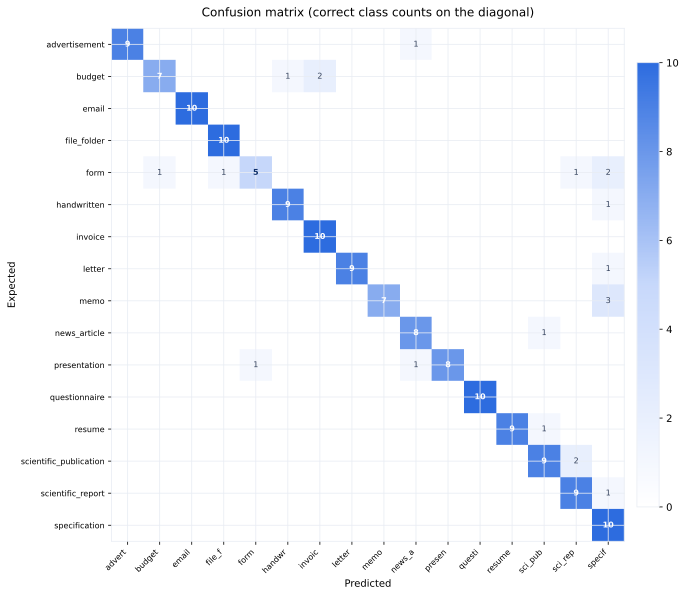

### Raw Counts

| Expected \ Predicted | `advert` | `budget` | `email` | `file_f` | `form` | `handwr` | `invoic` | `letter` | `memo` | `news_a` | `presen` | `questi` | `resume` | `scient` | `scient` | `specif` | `__inva` | **Total** | **Acc** |
|---:|---:|---:|---:|---:|---:|---:|---:|---:|---:|---:|---:|---:|---:|---:|---:|---:|---:|---:|---:|
| `advertisement` | **9** | . | . | . | . | . | . | . | . | 1 | . | . | . | . | . | . | . | 10 | 90% |
| `budget` | . | **7** | . | . | . | 1 | 2 | . | . | . | . | . | . | . | . | . | . | 10 | 70% |
| `email` | . | . | **10** | . | . | . | . | . | . | . | . | . | . | . | . | . | . | 10 | 100% |
| `file_folder` | . | . | . | **10** | . | . | . | . | . | . | . | . | . | . | . | . | . | 10 | 100% |
| `form` | . | 1 | . | 1 | **5** | . | . | . | . | . | . | . | . | . | 1 | 2 | . | 10 | 50% |
| `handwritten` | . | . | . | . | . | **9** | . | . | . | . | . | . | . | . | . | 1 | . | 10 | 90% |
| `invoice` | . | . | . | . | . | . | **10** | . | . | . | . | . | . | . | . | . | . | 10 | 100% |
| `letter` | . | . | . | . | . | . | . | **9** | . | . | . | . | . | . | . | 1 | . | 10 | 90% |
| `memo` | . | . | . | . | . | . | . | . | **7** | . | . | . | . | . | . | 3 | . | 10 | 70% |
| `news_article` | . | . | . | . | . | . | . | . | . | **8** | . | . | . | 1 | . | . | . | 9 | 89% |
| `presentation` | . | . | . | . | 1 | . | . | . | . | 1 | **8** | . | . | . | . | . | . | 10 | 80% |
| `questionnaire` | . | . | . | . | . | . | . | . | . | . | . | **10** | . | . | . | . | . | 10 | 100% |
| `resume` | . | . | . | . | . | . | . | . | . | . | . | . | **9** | 1 | . | . | . | 10 | 90% |
| `scientific_publication` | . | . | . | . | . | . | . | . | . | . | . | . | . | **9** | 2 | . | . | 11 | 82% |
| `scientific_report` | . | . | . | . | . | . | . | . | . | . | . | . | . | . | **9** | 1 | . | 10 | 90% |
| `specification` | . | . | . | . | . | . | . | . | . | . | . | . | . | . | . | **10** | . | 10 | 100% |
| `__invalid__` | . | . | . | . | . | . | . | . | . | . | . | . | . | . | . | . | . | 0 | 0% |

### Top Confused Pairs

| Expected | Predicted As | Count |
|----------|-------------|------:|
| `memo` | `specification` | 3 |
| `budget` | `invoice` | 2 |
| `form` | `specification` | 2 |
| `scientific_publication` | `scientific_report` | 2 |
| `advertisement` | `news_article` | 1 |
| `budget` | `handwritten` | 1 |
| `form` | `budget` | 1 |
| `form` | `file_folder` | 1 |
| `form` | `scientific_report` | 1 |
| `handwritten` | `specification` | 1 |
| `letter` | `specification` | 1 |
| `news_article` | `scientific_publication` | 1 |
| `presentation` | `form` | 1 |
| `presentation` | `news_article` | 1 |
| `resume` | `scientific_publication` | 1 |
| `scientific_report` | `specification` | 1 |

## Confusion Matrix — qwen3.5-35b-a3b_v11_8_reasoning_160

## Confusion Matrix — qwen3.5-35b-a3b_v11_8_reasoning_160

**Overall Accuracy:** 98.7% (155/157)  
**Dataset:** fixed_size_sampled  
**Model:** `qwen/qwen3.5-35b-a3b`

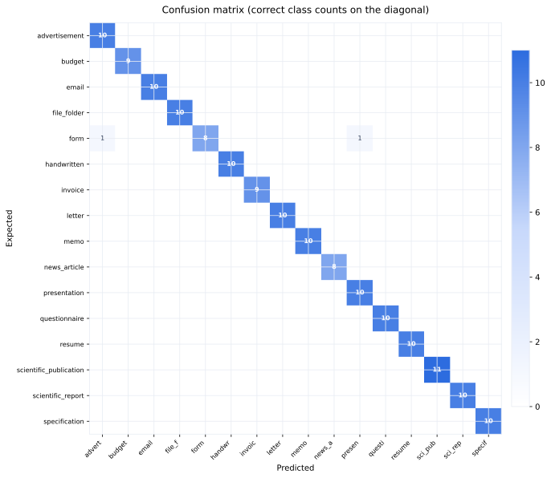

### Raw Counts

| Expected \ Predicted | `advert` | `budget` | `email` | `file_f` | `form` | `handwr` | `invoic` | `letter` | `memo` | `news_a` | `presen` | `questi` | `resume` | `scient` | `scient` | `specif` | `__inva` | **Total** | **Acc** |
|---:|---:|---:|---:|---:|---:|---:|---:|---:|---:|---:|---:|---:|---:|---:|---:|---:|---:|---:|---:|
| `advertisement` | **10** | . | . | . | . | . | . | . | . | . | . | . | . | . | . | . | . | 10 | 100% |
| `budget` | . | **9** | . | . | . | . | . | . | . | . | . | . | . | . | . | . | . | 9 | 100% |
| `email` | . | . | **10** | . | . | . | . | . | . | . | . | . | . | . | . | . | . | 10 | 100% |
| `file_folder` | . | . | . | **10** | . | . | . | . | . | . | . | . | . | . | . | . | . | 10 | 100% |
| `form` | 1 | . | . | . | **8** | . | . | . | . | . | 1 | . | . | . | . | . | . | 10 | 80% |
| `handwritten` | . | . | . | . | . | **10** | . | . | . | . | . | . | . | . | . | . | . | 10 | 100% |
| `invoice` | . | . | . | . | . | . | **9** | . | . | . | . | . | . | . | . | . | . | 9 | 100% |
| `letter` | . | . | . | . | . | . | . | **10** | . | . | . | . | . | . | . | . | . | 10 | 100% |
| `memo` | . | . | . | . | . | . | . | . | **10** | . | . | . | . | . | . | . | . | 10 | 100% |
| `news_article` | . | . | . | . | . | . | . | . | . | **8** | . | . | . | . | . | . | . | 8 | 100% |
| `presentation` | . | . | . | . | . | . | . | . | . | . | **10** | . | . | . | . | . | . | 10 | 100% |
| `questionnaire` | . | . | . | . | . | . | . | . | . | . | . | **10** | . | . | . | . | . | 10 | 100% |
| `resume` | . | . | . | . | . | . | . | . | . | . | . | . | **10** | . | . | . | . | 10 | 100% |
| `scientific_publication` | . | . | . | . | . | . | . | . | . | . | . | . | . | **11** | . | . | . | 11 | 100% |
| `scientific_report` | . | . | . | . | . | . | . | . | . | . | . | . | . | . | **10** | . | . | 10 | 100% |
| `specification` | . | . | . | . | . | . | . | . | . | . | . | . | . | . | . | **10** | . | 10 | 100% |
| `__invalid__` | . | . | . | . | . | . | . | . | . | . | . | . | . | . | . | . | . | 0 | 0% |

### Top Confused Pairs

| Expected | Predicted As | Count |
|----------|-------------|------:|
| `form` | `advertisement` | 1 |
| `form` | `presentation` | 1 |

## Confusion Matrix — qwen3.5-35b-a3b_v11_8_reasoning_v12retro

## Confusion Matrix — qwen3.5-35b-a3b_v11_8_reasoning_v12retro

**Overall Accuracy:** 30.8% (16/52)  
**Dataset:** qwen_v12_retroactive_eval  
**Model:** `qwen/qwen3.5-35b-a3b`

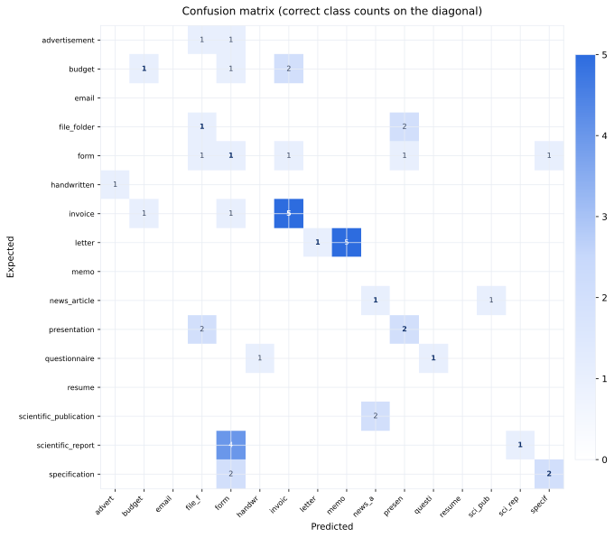

### Raw Counts

| Expected \ Predicted | `advert` | `budget` | `email` | `file_f` | `form` | `handwr` | `invoic` | `letter` | `memo` | `news_a` | `presen` | `questi` | `resume` | `scient` | `scient` | `specif` | `__inva` | **Total** | **Acc** |
|---:|---:|---:|---:|---:|---:|---:|---:|---:|---:|---:|---:|---:|---:|---:|---:|---:|---:|---:|---:|
| `advertisement` | . | . | . | 1 | 1 | . | . | . | . | . | . | . | . | . | . | . | . | 2 | 0% |
| `budget` | . | **1** | . | . | 1 | . | 2 | . | . | . | . | . | . | . | . | . | . | 4 | 25% |
| `email` | . | . | . | . | . | . | . | . | . | . | . | . | . | . | . | . | . | 0 | 0% |
| `file_folder` | . | . | . | **1** | . | . | . | . | . | . | 2 | . | . | . | . | . | . | 3 | 33% |
| `form` | . | . | . | 1 | **1** | . | 1 | . | . | . | 1 | . | . | . | . | 1 | 1 | 6 | 17% |
| `handwritten` | 1 | . | . | . | . | . | . | . | . | . | . | . | . | . | . | . | . | 1 | 0% |
| `invoice` | . | 1 | . | . | 1 | . | **5** | . | . | . | . | . | . | . | . | . | 1 | 8 | 62% |
| `letter` | . | . | . | . | . | . | . | **1** | 5 | . | . | . | . | . | . | . | . | 6 | 17% |
| `memo` | . | . | . | . | . | . | . | . | . | . | . | . | . | . | . | . | . | 0 | 0% |
| `news_article` | . | . | . | . | . | . | . | . | . | **1** | . | . | . | 1 | . | . | . | 2 | 50% |
| `presentation` | . | . | . | 2 | . | . | . | . | . | . | **2** | . | . | . | . | . | 1 | 5 | 40% |
| `questionnaire` | . | . | . | . | . | 1 | . | . | . | . | . | **1** | . | . | . | . | 1 | 3 | 33% |
| `resume` | . | . | . | . | . | . | . | . | . | . | . | . | . | . | . | . | . | 0 | 0% |
| `scientific_publication` | . | . | . | . | . | . | . | . | . | 2 | . | . | . | . | . | . | . | 2 | 0% |
| `scientific_report` | . | . | . | . | 4 | . | . | . | . | . | . | . | . | . | **1** | . | 1 | 6 | 17% |
| `specification` | . | . | . | . | 2 | . | . | . | . | . | . | . | . | . | . | **2** | . | 4 | 50% |
| `__invalid__` | . | . | . | . | . | . | . | . | . | . | . | . | . | . | . | . | . | 0 | 0% |

### Top Confused Pairs

| Expected | Predicted As | Count |
|----------|-------------|------:|
| `letter` | `memo` | 5 |
| `scientific_report` | `form` | 4 |
| `budget` | `invoice` | 2 |
| `file_folder` | `presentation` | 2 |
| `presentation` | `file_folder` | 2 |
| `scientific_publication` | `news_article` | 2 |
| `specification` | `form` | 2 |
| `advertisement` | `file_folder` | 1 |
| `advertisement` | `form` | 1 |
| `budget` | `form` | 1 |
| `form` | `file_folder` | 1 |
| `form` | `invoice` | 1 |
| `form` | `presentation` | 1 |
| `form` | `specification` | 1 |
| `form` | `__invalid__` | 1 |
| `handwritten` | `advertisement` | 1 |
| `invoice` | `budget` | 1 |
| `invoice` | `form` | 1 |
| `invoice` | `__invalid__` | 1 |
| `news_article` | `scientific_publication` | 1 |

## Confusion Matrix — qwen3.7-flash_v0_reasoning_480-d4c97ff0

## Confusion Matrix — qwen3.7-flash_v0_reasoning_480-d4c97ff0

**Overall Accuracy:** 69.2% (332/480)  
**Dataset:** 2550×3300 padded PNGs, 50 per class  
**Model:** `google/gemini-2.5-flash`

### Raw Counts

| Expected \ Predicted | `advert` | `budget` | `email` | `file_f` | `form` | `handwr` | `invoic` | `letter` | `memo` | `news_a` | `presen` | `questi` | `resume` | `scient` | `scient` | `specif` | **Total** | **Acc** |
|---:|---:|---:|---:|---:|---:|---:|---:|---:|---:|---:|---:|---:|---:|---:|---:|---:|---:|---:|
| `advertisement` | **28** | . | . | . | . | . | . | . | . | . | . | . | . | . | . | 1 | 29 | 97% |
| `budget` | 1 | **13** | . | . | 9 | 2 | 2 | . | . | . | . | . | . | . | 1 | . | 28 | 46% |
| `email` | . | . | **28** | . | . | . | . | . | 2 | . | . | . | . | . | . | . | 30 | 93% |
| `file_folder` | 1 | . | . | **24** | 3 | . | . | . | . | . | 1 | . | . | . | . | . | 29 | 83% |
| `form` | . | . | . | . | **22** | . | . | 1 | 1 | . | . | . | . | . | 3 | 1 | 28 | 79% |
| `handwritten` | 3 | . | 1 | . | 3 | **16** | . | 5 | 1 | . | . | . | . | . | 1 | . | 30 | 53% |
| `invoice` | 1 | . | . | . | 10 | . | **17** | 1 | 1 | . | . | . | . | . | . | . | 30 | 57% |
| `letter` | . | . | . | . | . | . | . | **21** | 8 | . | . | . | . | . | . | . | 29 | 72% |
| `memo` | . | . | . | . | . | . | . | . | **30** | . | . | . | . | . | . | . | 30 | 100% |
| `news_article` | 1 | . | . | . | . | . | . | . | 1 | **24** | . | . | . | 2 | 1 | . | 29 | 83% |
| `presentation` | 2 | . | . | 3 | 1 | 1 | . | 1 | 3 | 6 | **11** | . | . | . | . | . | 28 | 39% |
| `questionnaire` | . | . | . | . | 5 | 2 | . | 2 | . | . | . | **17** | . | . | 4 | . | 30 | 57% |
| `resume` | . | . | . | . | 9 | . | . | . | . | . | . | . | **18** | 1 | . | . | 28 | 64% |
| `scientific_publication` | . | . | . | . | . | . | . | . | . | 2 | . | . | . | **28** | . | . | 30 | 93% |
| `scientific_report` | . | . | . | . | 3 | . | . | 1 | 1 | . | . | . | . | 5 | **18** | . | 28 | 64% |
| `specification` | . | . | . | . | 8 | . | . | . | 1 | . | . | . | . | . | 2 | **17** | 28 | 61% |

### Top Confused Pairs

| Expected | Predicted As | Count |
|----------|-------------|------:|
| `invoice` | `form` | 10 |
| `budget` | `form` | 9 |
| `resume` | `form` | 9 |
| `letter` | `memo` | 8 |
| `specification` | `form` | 8 |
| `presentation` | `news_article` | 6 |
| `handwritten` | `letter` | 5 |
| `questionnaire` | `form` | 5 |
| `scientific_report` | `scientific_publication` | 5 |
| `questionnaire` | `scientific_report` | 4 |
| `file_folder` | `form` | 3 |
| `form` | `scientific_report` | 3 |
| `handwritten` | `advertisement` | 3 |
| `handwritten` | `form` | 3 |
| `presentation` | `file_folder` | 3 |
| `presentation` | `memo` | 3 |
| `scientific_report` | `form` | 3 |
| `budget` | `handwritten` | 2 |
| `budget` | `invoice` | 2 |
| `email` | `memo` | 2 |

## Confusion Matrix — qwen3.7-flash_v0_reasoning_800-f0b6b2e4

## Confusion Matrix — qwen3.7-flash_v0_reasoning_800-f0b6b2e4

**Overall Accuracy:** 66.1% (529/800)  
**Dataset:** rvl_cdip_800  
**Model:** `qwen/qwen3.7-flash`

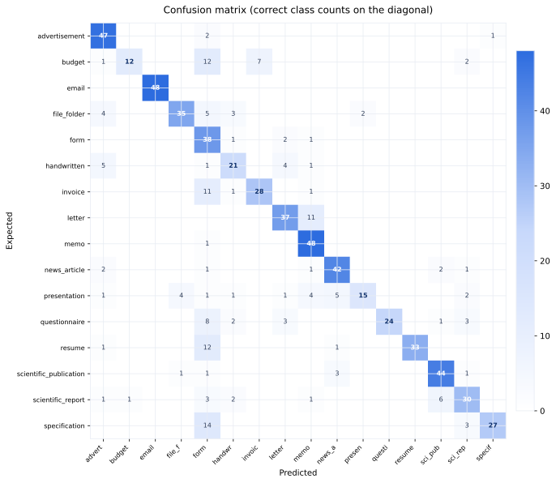

### Raw Counts

| Expected \ Predicted | `advert` | `budget` | `email` | `file_f` | `form` | `handwr` | `invoic` | `letter` | `memo` | `news_a` | `presen` | `questi` | `resume` | `scient` | `scient` | `specif` | `__inva` | **Total** | **Acc** |
|---:|---:|---:|---:|---:|---:|---:|---:|---:|---:|---:|---:|---:|---:|---:|---:|---:|---:|---:|---:|
| `advertisement` | **47** | . | . | . | 2 | . | . | . | . | . | . | . | . | . | . | 1 | . | 50 | 94% |
| `budget` | 1 | **12** | . | . | 12 | . | 7 | . | . | . | . | . | . | . | 2 | . | 16 | 50 | 24% |
| `email` | . | . | **48** | . | . | . | . | . | . | . | . | . | . | . | . | . | 2 | 50 | 96% |
| `file_folder` | 4 | . | . | **35** | 5 | 3 | . | . | . | . | 2 | . | . | . | . | . | 1 | 50 | 70% |
| `form` | . | . | . | . | **38** | 1 | . | 2 | 1 | . | . | . | . | . | . | . | 8 | 50 | 76% |
| `handwritten` | 5 | . | . | . | 1 | **21** | . | 4 | 1 | . | . | . | . | . | . | . | 18 | 50 | 42% |
| `invoice` | . | . | . | . | 11 | 1 | **28** | . | 1 | . | . | . | . | . | . | . | 9 | 50 | 56% |
| `letter` | . | . | . | . | . | . | . | **37** | 11 | . | . | . | . | . | . | . | 2 | 50 | 74% |
| `memo` | . | . | . | . | 1 | . | . | . | **48** | . | . | . | . | . | . | . | 1 | 50 | 96% |
| `news_article` | 2 | . | . | . | 1 | . | . | . | 1 | **42** | . | . | . | 2 | 1 | . | 1 | 50 | 84% |
| `presentation` | 1 | . | . | 4 | 1 | 1 | . | 1 | 4 | 5 | **15** | . | . | . | 2 | . | 16 | 50 | 30% |
| `questionnaire` | . | . | . | . | 8 | 2 | . | 3 | . | . | . | **24** | . | 1 | 3 | . | 9 | 50 | 48% |
| `resume` | 1 | . | . | . | 12 | . | . | . | . | 1 | . | . | **33** | . | . | . | 3 | 50 | 66% |
| `scientific_publication` | . | . | . | 1 | 1 | . | . | . | . | 3 | . | . | . | **44** | 1 | . | . | 50 | 88% |
| `scientific_report` | 1 | 1 | . | . | 3 | 2 | . | . | 1 | . | . | . | . | 6 | **30** | . | 6 | 50 | 60% |
| `specification` | . | . | . | . | 14 | . | . | . | . | . | . | . | . | . | 3 | **27** | 6 | 50 | 54% |
| `__invalid__` | . | . | . | . | . | . | . | . | . | . | . | . | . | . | . | . | . | 0 | 0% |

### Top Confused Pairs

| Expected | Predicted As | Count |
|----------|-------------|------:|
| `handwritten` | `__invalid__` | 18 |
| `budget` | `__invalid__` | 16 |
| `presentation` | `__invalid__` | 16 |
| `specification` | `form` | 14 |
| `budget` | `form` | 12 |
| `resume` | `form` | 12 |
| `invoice` | `form` | 11 |
| `letter` | `memo` | 11 |
| `invoice` | `__invalid__` | 9 |
| `questionnaire` | `__invalid__` | 9 |
| `form` | `__invalid__` | 8 |
| `questionnaire` | `form` | 8 |
| `budget` | `invoice` | 7 |
| `scientific_report` | `scientific_publication` | 6 |
| `scientific_report` | `__invalid__` | 6 |
| `specification` | `__invalid__` | 6 |
| `file_folder` | `form` | 5 |
| `handwritten` | `advertisement` | 5 |
| `presentation` | `news_article` | 5 |
| `file_folder` | `advertisement` | 4 |

## Confusion Matrix — qwen3.7-flash_v11.8_reasoning_800-f6f4648b

## Confusion Matrix — qwen3.7-flash_v11.8_reasoning_800-f6f4648b

**Overall Accuracy:** 83.1% (665/800)  
**Dataset:** rvl_cdip_800  
**Model:** `qwen/qwen3.7-flash`

### Raw Counts

| Expected \ Predicted | `advert` | `budget` | `email` | `file_f` | `form` | `handwr` | `invoic` | `letter` | `memo` | `news_a` | `presen` | `questi` | `resume` | `scient` | `scient` | `specif` | `__inva` | **Total** | **Acc** |
|---:|---:|---:|---:|---:|---:|---:|---:|---:|---:|---:|---:|---:|---:|---:|---:|---:|---:|---:|---:|
| `advertisement` | **44** | . | . | 1 | 1 | . | . | . | . | . | 4 | . | . | . | . | . | . | 50 | 88% |
| `budget` | . | **34** | . | . | 2 | . | 13 | . | 1 | . | . | . | . | . | . | . | . | 50 | 68% |
| `email` | . | . | **48** | . | 1 | . | . | . | . | . | 1 | . | . | . | . | . | . | 50 | 96% |
| `file_folder` | . | . | . | **42** | 2 | 1 | . | . | . | . | 5 | . | . | . | . | . | . | 50 | 84% |
| `form` | . | . | . | 2 | **40** | 1 | 2 | 1 | 1 | . | . | 2 | . | . | . | 1 | . | 50 | 80% |
| `handwritten` | 1 | . | . | . | 1 | **44** | . | . | . | . | 2 | 1 | . | . | 1 | . | . | 50 | 88% |
| `invoice` | . | 7 | . | . | 6 | 1 | **36** | . | . | . | . | . | . | . | . | . | . | 50 | 72% |
| `letter` | . | 1 | . | . | . | 1 | . | **38** | 10 | . | . | . | . | . | . | . | . | 50 | 76% |
| `memo` | . | . | 1 | . | 3 | . | . | 2 | **44** | . | . | . | . | . | . | . | . | 50 | 88% |
| `news_article` | 2 | . | . | . | 1 | . | . | . | 1 | **42** | . | . | . | 1 | 1 | . | 2 | 50 | 84% |
| `presentation` | . | 1 | . | 3 | 1 | 1 | . | . | 3 | . | **38** | . | . | . | 3 | . | . | 50 | 76% |
| `questionnaire` | . | . | . | . | . | 1 | . | . | 1 | . | 2 | **45** | . | . | 1 | . | . | 50 | 90% |
| `resume` | . | . | . | . | . | . | . | . | . | . | . | . | **49** | . | . | . | 1 | 50 | 98% |
| `scientific_publication` | . | . | . | 1 | . | . | . | . | . | 3 | 1 | . | . | **43** | 2 | . | . | 50 | 86% |
| `scientific_report` | . | . | . | . | 6 | 2 | . | . | 1 | . | 1 | . | . | 2 | **34** | 4 | . | 50 | 68% |
| `specification` | . | . | . | . | 5 | . | . | . | . | 1 | . | . | . | . | . | **44** | . | 50 | 88% |
| `__invalid__` | . | . | . | . | . | . | . | . | . | . | . | . | . | . | . | . | . | 0 | 0% |

### Top Confused Pairs

| Expected | Predicted As | Count |
|----------|-------------|------:|
| `budget` | `invoice` | 13 |
| `letter` | `memo` | 10 |
| `invoice` | `budget` | 7 |
| `invoice` | `form` | 6 |
| `scientific_report` | `form` | 6 |
| `file_folder` | `presentation` | 5 |
| `specification` | `form` | 5 |
| `advertisement` | `presentation` | 4 |
| `scientific_report` | `specification` | 4 |
| `memo` | `form` | 3 |
| `presentation` | `file_folder` | 3 |
| `presentation` | `memo` | 3 |
| `presentation` | `scientific_report` | 3 |
| `scientific_publication` | `news_article` | 3 |
| `budget` | `form` | 2 |
| `file_folder` | `form` | 2 |
| `form` | `file_folder` | 2 |
| `form` | `invoice` | 2 |
| `form` | `questionnaire` | 2 |
| `handwritten` | `presentation` | 2 |

## Confusion Matrix — qwen3.7-flash_v11_7_reasoning_160

## Confusion Matrix — qwen3.7-flash_v11_7_reasoning_160

**Overall Accuracy:** 98.1% (156/159)  
**Dataset:** fixed_size_sampled  
**Model:** `qwen/qwen3.7-flash`

### Raw Counts

| Expected \ Predicted | `advert` | `budget` | `email` | `file_f` | `form` | `handwr` | `invoic` | `letter` | `memo` | `news_a` | `presen` | `questi` | `resume` | `scient` | `scient` | `specif` | **Total** | **Acc** |
|---:|---:|---:|---:|---:|---:|---:|---:|---:|---:|---:|---:|---:|---:|---:|---:|---:|---:|---:|
| `advertisement` | **9** | . | . | . | . | . | . | . | . | . | . | . | . | . | . | . | 9 | 100% |
| `budget` | . | **9** | . | . | . | . | 1 | . | . | . | . | . | . | . | . | . | 10 | 90% |
| `email` | . | . | **10** | . | . | . | . | . | . | . | . | . | . | . | . | . | 10 | 100% |
| `file_folder` | . | . | . | **10** | . | . | . | . | . | . | . | . | . | . | . | . | 10 | 100% |
| `form` | . | 1 | . | . | **9** | . | . | . | . | . | . | . | . | . | . | . | 10 | 90% |
| `handwritten` | . | . | . | . | . | **10** | . | . | . | . | . | . | . | . | . | . | 10 | 100% |
| `invoice` | . | . | . | . | . | . | **10** | . | . | . | . | . | . | . | . | . | 10 | 100% |
| `letter` | . | . | . | . | . | . | . | **9** | 1 | . | . | . | . | . | . | . | 10 | 90% |
| `memo` | . | . | . | . | . | . | . | . | **10** | . | . | . | . | . | . | . | 10 | 100% |
| `news_article` | . | . | . | . | . | . | . | . | . | **9** | . | . | . | . | . | . | 9 | 100% |
| `presentation` | . | . | . | . | . | . | . | . | . | . | **10** | . | . | . | . | . | 10 | 100% |
| `questionnaire` | . | . | . | . | . | . | . | . | . | . | . | **10** | . | . | . | . | 10 | 100% |
| `resume` | . | . | . | . | . | . | . | . | . | . | . | . | **10** | . | . | . | 10 | 100% |
| `scientific_publication` | . | . | . | . | . | . | . | . | . | . | . | . | . | **11** | . | . | 11 | 100% |
| `scientific_report` | . | . | . | . | . | . | . | . | . | . | . | . | . | . | **10** | . | 10 | 100% |
| `specification` | . | . | . | . | . | . | . | . | . | . | . | . | . | . | . | **10** | 10 | 100% |

### Top Confused Pairs

| Expected | Predicted As | Count |
|----------|-------------|------:|
| `budget` | `invoice` | 1 |
| `form` | `budget` | 1 |
| `letter` | `memo` | 1 |

## Confusion Matrix — qwen3.7-flash_v11_8_reasoning_160_t0_3

## Confusion Matrix — qwen3.7-flash_v11_8_reasoning_160_t0_3

**Overall Accuracy:** 98.7% (157/159)  
**Dataset:** fixed_size_sampled  
**Model:** `qwen/qwen3.7-flash`

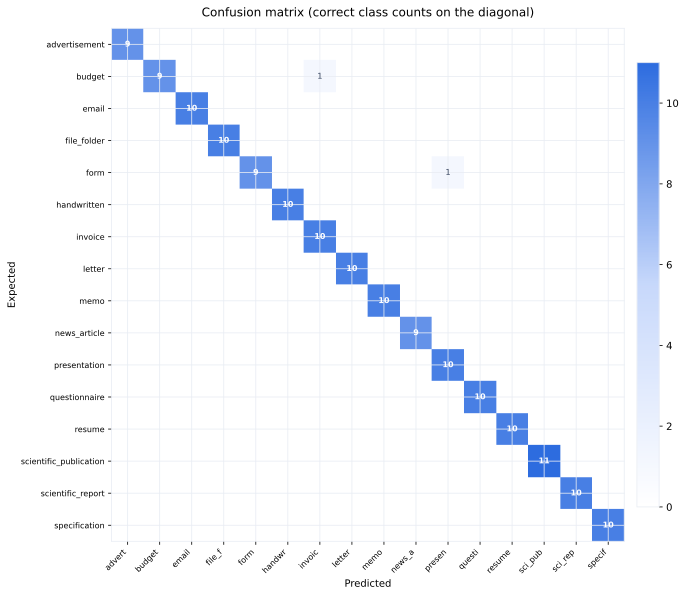

### Raw Counts

| Expected \ Predicted | `advert` | `budget` | `email` | `file_f` | `form` | `handwr` | `invoic` | `letter` | `memo` | `news_a` | `presen` | `questi` | `resume` | `scient` | `scient` | `specif` | `__inva` | **Total** | **Acc** |
|---:|---:|---:|---:|---:|---:|---:|---:|---:|---:|---:|---:|---:|---:|---:|---:|---:|---:|---:|---:|
| `advertisement` | **9** | . | . | . | . | . | . | . | . | . | . | . | . | . | . | . | . | 9 | 100% |
| `budget` | . | **9** | . | . | . | . | 1 | . | . | . | . | . | . | . | . | . | . | 10 | 90% |
| `email` | . | . | **10** | . | . | . | . | . | . | . | . | . | . | . | . | . | . | 10 | 100% |
| `file_folder` | . | . | . | **10** | . | . | . | . | . | . | . | . | . | . | . | . | . | 10 | 100% |
| `form` | . | . | . | . | **9** | . | . | . | . | . | 1 | . | . | . | . | . | . | 10 | 90% |
| `handwritten` | . | . | . | . | . | **10** | . | . | . | . | . | . | . | . | . | . | . | 10 | 100% |
| `invoice` | . | . | . | . | . | . | **10** | . | . | . | . | . | . | . | . | . | . | 10 | 100% |
| `letter` | . | . | . | . | . | . | . | **10** | . | . | . | . | . | . | . | . | . | 10 | 100% |
| `memo` | . | . | . | . | . | . | . | . | **10** | . | . | . | . | . | . | . | . | 10 | 100% |
| `news_article` | . | . | . | . | . | . | . | . | . | **9** | . | . | . | . | . | . | . | 9 | 100% |
| `presentation` | . | . | . | . | . | . | . | . | . | . | **10** | . | . | . | . | . | . | 10 | 100% |
| `questionnaire` | . | . | . | . | . | . | . | . | . | . | . | **10** | . | . | . | . | . | 10 | 100% |
| `resume` | . | . | . | . | . | . | . | . | . | . | . | . | **10** | . | . | . | . | 10 | 100% |
| `scientific_publication` | . | . | . | . | . | . | . | . | . | . | . | . | . | **11** | . | . | . | 11 | 100% |
| `scientific_report` | . | . | . | . | . | . | . | . | . | . | . | . | . | . | **10** | . | . | 10 | 100% |
| `specification` | . | . | . | . | . | . | . | . | . | . | . | . | . | . | . | **10** | . | 10 | 100% |
| `__invalid__` | . | . | . | . | . | . | . | . | . | . | . | . | . | . | . | . | . | 0 | 0% |

### Top Confused Pairs

| Expected | Predicted As | Count |
|----------|-------------|------:|
| `budget` | `invoice` | 1 |
| `form` | `presentation` | 1 |

## Confusion Matrix — qwen3.7-flash_v11_8_reasoning_320

## Confusion Matrix — qwen3.7-flash_v11_8_reasoning_320

**Overall Accuracy:** 87.1% (277/318)  
**Dataset:** fixed_size_sampled_320  
**Model:** `qwen/qwen3.7-flash`

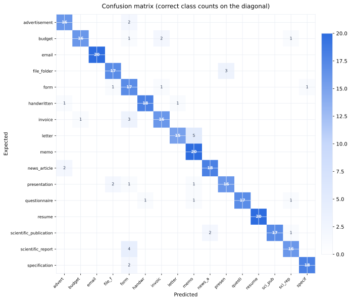

### Raw Counts

| Expected \ Predicted | `advert` | `budget` | `email` | `file_f` | `form` | `handwr` | `invoic` | `letter` | `memo` | `news_a` | `presen` | `questi` | `resume` | `scient` | `scient` | `specif` | `__inva` | **Total** | **Acc** |
|---:|---:|---:|---:|---:|---:|---:|---:|---:|---:|---:|---:|---:|---:|---:|---:|---:|---:|---:|---:|
| `advertisement` | **16** | . | . | . | 2 | . | . | . | . | . | . | . | . | . | . | . | . | 18 | 89% |
| `budget` | . | **16** | . | . | 1 | . | 2 | . | . | . | . | . | . | . | 1 | . | . | 20 | 80% |
| `email` | . | . | **20** | . | . | . | . | . | . | . | . | . | . | . | . | . | . | 20 | 100% |
| `file_folder` | . | . | . | **17** | . | . | . | . | . | . | 3 | . | . | . | . | . | . | 20 | 85% |
| `form` | . | . | . | 1 | **17** | . | 1 | . | . | . | . | . | . | . | . | 1 | . | 20 | 85% |
| `handwritten` | 1 | . | . | . | . | **18** | . | 1 | . | . | . | . | . | . | . | . | . | 20 | 90% |
| `invoice` | . | 1 | . | . | 3 | . | **16** | . | . | . | . | . | . | . | . | . | . | 20 | 80% |
| `letter` | . | . | . | . | . | . | . | **15** | 5 | . | . | . | . | . | . | . | . | 20 | 75% |
| `memo` | . | . | . | . | . | . | . | . | **20** | . | . | . | . | . | . | . | . | 20 | 100% |
| `news_article` | 2 | . | . | . | . | . | . | . | . | **18** | . | . | . | . | . | . | . | 20 | 90% |
| `presentation` | . | . | . | 2 | 1 | . | . | . | 1 | . | **16** | . | . | . | . | . | . | 20 | 80% |
| `questionnaire` | . | . | . | . | . | 1 | . | . | 1 | . | . | **17** | . | . | 1 | . | . | 20 | 85% |
| `resume` | . | . | . | . | . | . | . | . | . | . | . | . | **20** | . | . | . | . | 20 | 100% |
| `scientific_publication` | . | . | . | . | . | . | . | . | . | 2 | . | . | . | **17** | 1 | . | . | 20 | 85% |
| `scientific_report` | . | . | . | . | 4 | . | . | . | . | . | . | . | . | . | **16** | . | . | 20 | 80% |
| `specification` | . | . | . | . | 2 | . | . | . | . | . | . | . | . | . | . | **18** | . | 20 | 90% |
| `__invalid__` | . | . | . | . | . | . | . | . | . | . | . | . | . | . | . | . | . | 0 | 0% |

### Top Confused Pairs

| Expected | Predicted As | Count |
|----------|-------------|------:|
| `letter` | `memo` | 5 |
| `scientific_report` | `form` | 4 |
| `file_folder` | `presentation` | 3 |
| `invoice` | `form` | 3 |
| `advertisement` | `form` | 2 |
| `budget` | `invoice` | 2 |
| `news_article` | `advertisement` | 2 |
| `presentation` | `file_folder` | 2 |
| `scientific_publication` | `news_article` | 2 |
| `specification` | `form` | 2 |
| `budget` | `form` | 1 |
| `budget` | `scientific_report` | 1 |
| `form` | `file_folder` | 1 |
| `form` | `invoice` | 1 |
| `form` | `specification` | 1 |
| `handwritten` | `advertisement` | 1 |
| `handwritten` | `letter` | 1 |
| `invoice` | `budget` | 1 |
| `presentation` | `form` | 1 |
| `presentation` | `memo` | 1 |

## Confusion Matrix — qwen3.7-flash_v11_reasoning_160

## Confusion Matrix — qwen3.7-flash_v11_reasoning_160

**Overall Accuracy:** 98.7% (156/158)  
**Dataset:** fixed_size_sampled  
**Model:** `qwen/qwen3.7-flash`

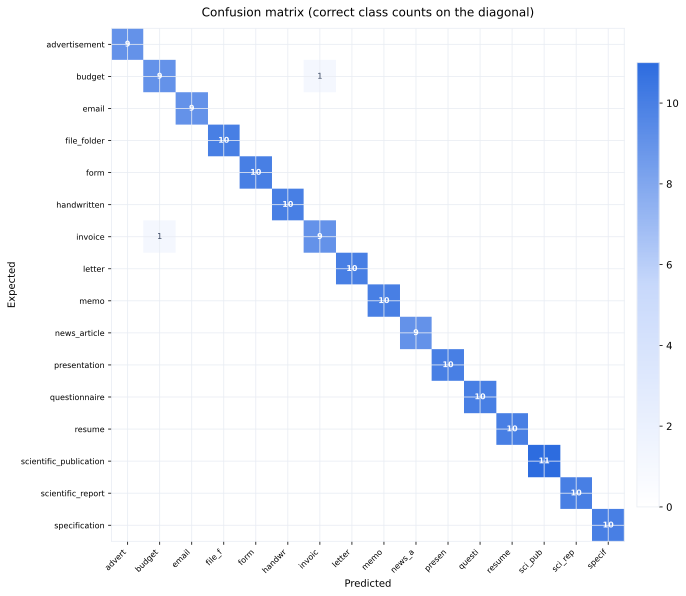

### Raw Counts

| Expected \ Predicted | `advert` | `budget` | `email` | `file_f` | `form` | `handwr` | `invoic` | `letter` | `memo` | `news_a` | `presen` | `questi` | `resume` | `scient` | `scient` | `specif` | **Total** | **Acc** |
|---:|---:|---:|---:|---:|---:|---:|---:|---:|---:|---:|---:|---:|---:|---:|---:|---:|---:|---:|
| `advertisement` | **9** | . | . | . | . | . | . | . | . | . | . | . | . | . | . | . | 9 | 100% |
| `budget` | . | **9** | . | . | . | . | 1 | . | . | . | . | . | . | . | . | . | 10 | 90% |
| `email` | . | . | **9** | . | . | . | . | . | . | . | . | . | . | . | . | . | 9 | 100% |
| `file_folder` | . | . | . | **10** | . | . | . | . | . | . | . | . | . | . | . | . | 10 | 100% |
| `form` | . | . | . | . | **10** | . | . | . | . | . | . | . | . | . | . | . | 10 | 100% |
| `handwritten` | . | . | . | . | . | **10** | . | . | . | . | . | . | . | . | . | . | 10 | 100% |
| `invoice` | . | 1 | . | . | . | . | **9** | . | . | . | . | . | . | . | . | . | 10 | 90% |
| `letter` | . | . | . | . | . | . | . | **10** | . | . | . | . | . | . | . | . | 10 | 100% |
| `memo` | . | . | . | . | . | . | . | . | **10** | . | . | . | . | . | . | . | 10 | 100% |
| `news_article` | . | . | . | . | . | . | . | . | . | **9** | . | . | . | . | . | . | 9 | 100% |
| `presentation` | . | . | . | . | . | . | . | . | . | . | **10** | . | . | . | . | . | 10 | 100% |
| `questionnaire` | . | . | . | . | . | . | . | . | . | . | . | **10** | . | . | . | . | 10 | 100% |
| `resume` | . | . | . | . | . | . | . | . | . | . | . | . | **10** | . | . | . | 10 | 100% |
| `scientific_publication` | . | . | . | . | . | . | . | . | . | . | . | . | . | **11** | . | . | 11 | 100% |
| `scientific_report` | . | . | . | . | . | . | . | . | . | . | . | . | . | . | **10** | . | 10 | 100% |
| `specification` | . | . | . | . | . | . | . | . | . | . | . | . | . | . | . | **10** | 10 | 100% |

### Top Confused Pairs

| Expected | Predicted As | Count |
|----------|-------------|------:|
| `budget` | `invoice` | 1 |
| `invoice` | `budget` | 1 |

## Confusion Matrix — qwen3.7-flash_v11_reasoning_320

## Confusion Matrix — qwen3.7-flash_v11_reasoning_320

**Overall Accuracy:** 83.8% (264/315)  
**Dataset:** fixed_size_sampled_320  
**Model:** `qwen/qwen3.7-flash`

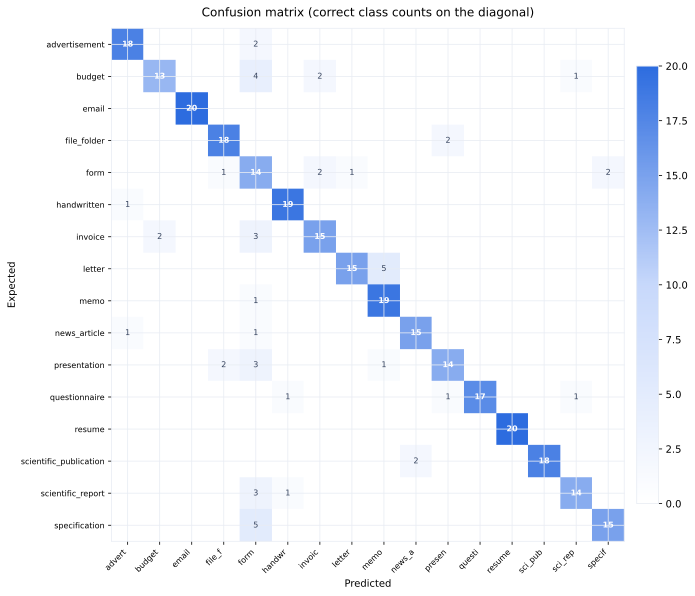

### Raw Counts

| Expected \ Predicted | `advert` | `budget` | `email` | `file_f` | `form` | `handwr` | `invoic` | `letter` | `memo` | `news_a` | `presen` | `questi` | `resume` | `scient` | `scient` | `specif` | **Total** | **Acc** |
|---:|---:|---:|---:|---:|---:|---:|---:|---:|---:|---:|---:|---:|---:|---:|---:|---:|---:|---:|
| `advertisement` | **18** | . | . | . | 2 | . | . | . | . | . | . | . | . | . | . | . | 20 | 90% |
| `budget` | . | **13** | . | . | 4 | . | 2 | . | . | . | . | . | . | . | 1 | . | 20 | 65% |
| `email` | . | . | **20** | . | . | . | . | . | . | . | . | . | . | . | . | . | 20 | 100% |
| `file_folder` | . | . | . | **18** | . | . | . | . | . | . | 2 | . | . | . | . | . | 20 | 90% |
| `form` | . | . | . | 1 | **14** | . | 2 | 1 | . | . | . | . | . | . | . | 2 | 20 | 70% |
| `handwritten` | 1 | . | . | . | . | **19** | . | . | . | . | . | . | . | . | . | . | 20 | 95% |
| `invoice` | . | 2 | . | . | 3 | . | **15** | . | . | . | . | . | . | . | . | . | 20 | 75% |
| `letter` | . | . | . | . | . | . | . | **15** | 5 | . | . | . | . | . | . | . | 20 | 75% |
| `memo` | . | . | . | . | 1 | . | . | . | **19** | . | . | . | . | . | . | . | 20 | 95% |
| `news_article` | 1 | . | . | . | 1 | . | . | . | . | **15** | . | . | . | . | . | . | 17 | 88% |
| `presentation` | . | . | . | 2 | 3 | . | . | . | 1 | . | **14** | . | . | . | . | . | 20 | 70% |
| `questionnaire` | . | . | . | . | . | 1 | . | . | . | . | 1 | **17** | . | . | 1 | . | 20 | 85% |
| `resume` | . | . | . | . | . | . | . | . | . | . | . | . | **20** | . | . | . | 20 | 100% |
| `scientific_publication` | . | . | . | . | . | . | . | . | . | 2 | . | . | . | **18** | . | . | 20 | 90% |
| `scientific_report` | . | . | . | . | 3 | 1 | . | . | . | . | . | . | . | . | **14** | . | 18 | 78% |
| `specification` | . | . | . | . | 5 | . | . | . | . | . | . | . | . | . | . | **15** | 20 | 75% |

### Top Confused Pairs

| Expected | Predicted As | Count |
|----------|-------------|------:|
| `letter` | `memo` | 5 |
| `specification` | `form` | 5 |
| `budget` | `form` | 4 |
| `invoice` | `form` | 3 |
| `presentation` | `form` | 3 |
| `scientific_report` | `form` | 3 |
| `advertisement` | `form` | 2 |
| `budget` | `invoice` | 2 |
| `file_folder` | `presentation` | 2 |
| `form` | `invoice` | 2 |
| `form` | `specification` | 2 |
| `invoice` | `budget` | 2 |
| `presentation` | `file_folder` | 2 |
| `scientific_publication` | `news_article` | 2 |
| `budget` | `scientific_report` | 1 |
| `form` | `file_folder` | 1 |
| `form` | `letter` | 1 |
| `handwritten` | `advertisement` | 1 |
| `memo` | `form` | 1 |
| `news_article` | `advertisement` | 1 |

## Confusion Matrix — qwen3.7-flash_v11_smoke_full

## Confusion Matrix — qwen3.7-flash_v11_smoke_full

**Overall Accuracy:** 87.7% (207/236)  
**Dataset:** qwen_misclassification_smoke_v1_v11  
**Model:** `qwen/qwen3.7-flash`

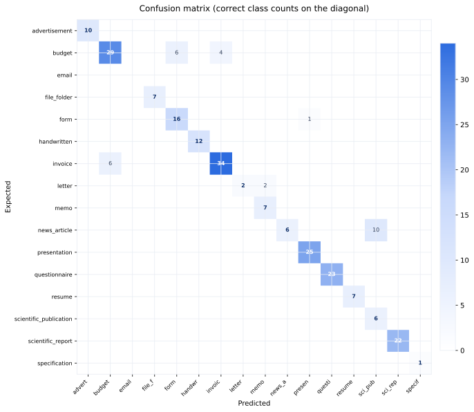

### Raw Counts

| Expected \ Predicted | `advert` | `budget` | `email` | `file_f` | `form` | `handwr` | `invoic` | `letter` | `memo` | `news_a` | `presen` | `questi` | `resume` | `scient` | `scient` | `specif` | **Total** | **Acc** |
|---:|---:|---:|---:|---:|---:|---:|---:|---:|---:|---:|---:|---:|---:|---:|---:|---:|---:|---:|
| `advertisement` | **10** | . | . | . | . | . | . | . | . | . | . | . | . | . | . | . | 10 | 100% |
| `budget` | . | **29** | . | . | 6 | . | 4 | . | . | . | . | . | . | . | . | . | 39 | 74% |
| `email` | . | . | . | . | . | . | . | . | . | . | . | . | . | . | . | . | 0 | 0% |
| `file_folder` | . | . | . | **7** | . | . | . | . | . | . | . | . | . | . | . | . | 7 | 100% |
| `form` | . | . | . | . | **16** | . | . | . | . | . | 1 | . | . | . | . | . | 17 | 94% |
| `handwritten` | . | . | . | . | . | **12** | . | . | . | . | . | . | . | . | . | . | 12 | 100% |
| `invoice` | . | 6 | . | . | . | . | **34** | . | . | . | . | . | . | . | . | . | 40 | 85% |
| `letter` | . | . | . | . | . | . | . | **2** | 2 | . | . | . | . | . | . | . | 4 | 50% |
| `memo` | . | . | . | . | . | . | . | . | **7** | . | . | . | . | . | . | . | 7 | 100% |
| `news_article` | . | . | . | . | . | . | . | . | . | **6** | . | . | . | 10 | . | . | 16 | 38% |
| `presentation` | . | . | . | . | . | . | . | . | . | . | **25** | . | . | . | . | . | 25 | 100% |
| `questionnaire` | . | . | . | . | . | . | . | . | . | . | . | **23** | . | . | . | . | 23 | 100% |
| `resume` | . | . | . | . | . | . | . | . | . | . | . | . | **7** | . | . | . | 7 | 100% |
| `scientific_publication` | . | . | . | . | . | . | . | . | . | . | . | . | . | **6** | . | . | 6 | 100% |
| `scientific_report` | . | . | . | . | . | . | . | . | . | . | . | . | . | . | **22** | . | 22 | 100% |
| `specification` | . | . | . | . | . | . | . | . | . | . | . | . | . | . | . | **1** | 1 | 100% |

### Top Confused Pairs

| Expected | Predicted As | Count |
|----------|-------------|------:|
| `news_article` | `scientific_publication` | 10 |
| `budget` | `form` | 6 |
| `invoice` | `budget` | 6 |
| `budget` | `invoice` | 4 |
| `letter` | `memo` | 2 |
| `form` | `presentation` | 1 |

## Confusion Matrix — qwen3.7-flash_v14_reasoning_160_v2_retry

## Confusion Matrix — qwen3.7-flash_v14_reasoning_160_v2_retry

**Overall Accuracy:** 85.0% (136/160)
**Dataset:** fixed_size_sampled_v2
**Model:** `qwen/qwen3.7-flash`

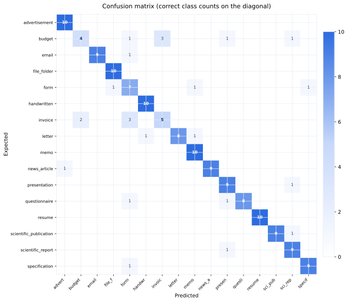

### Raw Counts

| Expected \ Predicted | `advert` | `budget` | `email` | `file_f` | `form` | `handwr` | `invoic` | `letter` | `memo` | `news_a` | `presen` | `questi` | `resume` | `scient` | `scient` | `specif` | `__inva` | **Total** | **Acc** |
|---:|---:|---:|---:|---:|---:|---:|---:|---:|---:|---:|---:|---:|---:|---:|---:|---:|---:|---:|---:|
| `advertisement` | **10** | . | . | . | . | . | . | . | . | . | . | . | . | . | . | . | . | 10 | 100% |
| `budget` | . | **4** | . | . | 1 | . | 3 | . | . | . | 1 | . | . | . | 1 | . | . | 10 | 40% |
| `email` | . | . | **9** | . | 1 | . | . | . | . | . | . | . | . | . | . | . | . | 10 | 90% |
| `file_folder` | . | . | . | **10** | . | . | . | . | . | . | . | . | . | . | . | . | . | 10 | 100% |
| `form` | . | . | . | 1 | **7** | . | . | . | 1 | . | . | . | . | . | . | 1 | . | 10 | 70% |
| `handwritten` | . | . | . | . | . | **10** | . | . | . | . | . | . | . | . | . | . | . | 10 | 100% |
| `invoice` | . | 2 | . | . | 3 | . | **5** | . | . | . | . | . | . | . | . | . | . | 10 | 50% |
| `letter` | . | . | . | . | . | 1 | . | **8** | 1 | . | . | . | . | . | . | . | . | 10 | 80% |
| `memo` | . | . | . | . | . | . | . | . | **10** | . | . | . | . | . | . | . | . | 10 | 100% |
| `news_article` | 1 | . | . | . | . | . | . | . | . | **9** | . | . | . | . | . | . | . | 10 | 90% |
| `presentation` | . | . | . | . | . | . | . | . | . | . | **9** | . | . | . | 1 | . | . | 10 | 90% |
| `questionnaire` | . | . | . | . | 1 | . | . | . | . | . | 1 | **8** | . | . | . | . | . | 10 | 80% |
| `resume` | . | . | . | . | . | . | . | . | . | . | . | . | **10** | . | . | . | . | 10 | 100% |
| `scientific_publication` | . | . | . | . | . | . | . | . | . | . | . | . | . | **9** | 1 | . | . | 10 | 90% |
| `scientific_report` | . | . | . | . | . | . | . | . | . | . | 1 | . | . | . | **9** | . | . | 10 | 90% |
| `specification` | . | . | . | . | 1 | . | . | . | . | . | . | . | . | . | . | **9** | . | 10 | 90% |
| `__invalid__` | . | . | . | . | . | . | . | . | . | . | . | . | . | . | . | . | . | 0 | 0% |

### Top Confused Pairs

| Expected | Predicted As | Count |
|----------|-------------|------:|
| `budget` | `invoice` | 3 |
| `invoice` | `form` | 3 |
| `invoice` | `budget` | 2 |
| `budget` | `form` | 1 |
| `budget` | `presentation` | 1 |
| `budget` | `scientific_report` | 1 |
| `email` | `form` | 1 |
| `form` | `file_folder` | 1 |
| `form` | `memo` | 1 |
| `form` | `specification` | 1 |
| `letter` | `handwritten` | 1 |
| `letter` | `memo` | 1 |
| `news_article` | `advertisement` | 1 |
| `presentation` | `scientific_report` | 1 |
| `questionnaire` | `form` | 1 |
| `questionnaire` | `presentation` | 1 |
| `scientific_publication` | `scientific_report` | 1 |
| `scientific_report` | `presentation` | 1 |
| `specification` | `form` | 1 |

## Confusion Matrix — main-1785270444

## Confusion Matrix — main-1785270444

**Overall Accuracy:** 73.8% (118/160)  
**Dataset:** 2550×3300 padded PNGs, 50 per class  
**Model:** `google/gemini-2.5-flash`

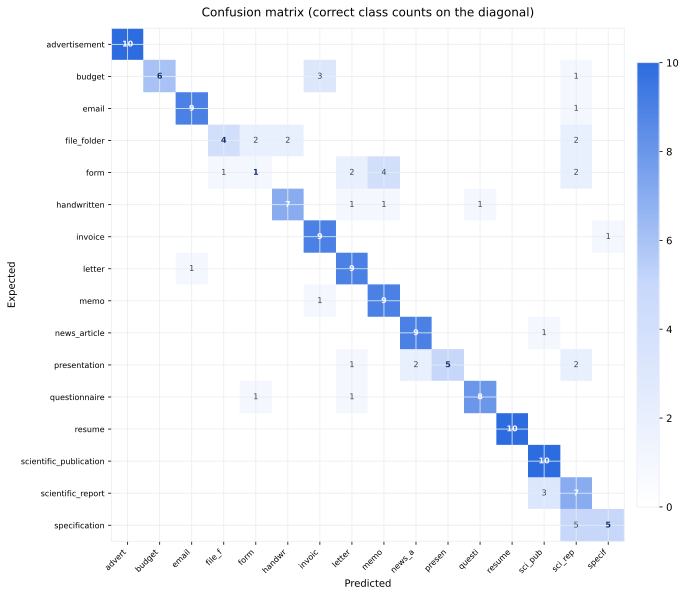

### Raw Counts

| Expected \ Predicted | `advert` | `budget` | `email` | `file_f` | `form` | `handwr` | `invoic` | `letter` | `memo` | `news_a` | `presen` | `questi` | `resume` | `scient` | `scient` | `specif` | **Total** | **Acc** |
|---:|---:|---:|---:|---:|---:|---:|---:|---:|---:|---:|---:|---:|---:|---:|---:|---:|---:|---:|
| `advertisement` | **10** | . | . | . | . | . | . | . | . | . | . | . | . | . | . | . | 10 | 100% |
| `budget` | . | **6** | . | . | . | . | 3 | . | . | . | . | . | . | . | 1 | . | 10 | 60% |
| `email` | . | . | **9** | . | . | . | . | . | . | . | . | . | . | . | 1 | . | 10 | 90% |
| `file_folder` | . | . | . | **4** | 2 | 2 | . | . | . | . | . | . | . | . | 2 | . | 10 | 40% |
| `form` | . | . | . | 1 | **1** | . | . | 2 | 4 | . | . | . | . | . | 2 | . | 10 | 10% |
| `handwritten` | . | . | . | . | . | **7** | . | 1 | 1 | . | . | 1 | . | . | . | . | 10 | 70% |
| `invoice` | . | . | . | . | . | . | **9** | . | . | . | . | . | . | . | . | 1 | 10 | 90% |
| `letter` | . | . | 1 | . | . | . | . | **9** | . | . | . | . | . | . | . | . | 10 | 90% |
| `memo` | . | . | . | . | . | . | 1 | . | **9** | . | . | . | . | . | . | . | 10 | 90% |
| `news_article` | . | . | . | . | . | . | . | . | . | **9** | . | . | . | 1 | . | . | 10 | 90% |
| `presentation` | . | . | . | . | . | . | . | 1 | . | 2 | **5** | . | . | . | 2 | . | 10 | 50% |
| `questionnaire` | . | . | . | . | 1 | . | . | 1 | . | . | . | **8** | . | . | . | . | 10 | 80% |
| `resume` | . | . | . | . | . | . | . | . | . | . | . | . | **10** | . | . | . | 10 | 100% |
| `scientific_publication` | . | . | . | . | . | . | . | . | . | . | . | . | . | **10** | . | . | 10 | 100% |
| `scientific_report` | . | . | . | . | . | . | . | . | . | . | . | . | . | 3 | **7** | . | 10 | 70% |
| `specification` | . | . | . | . | . | . | . | . | . | . | . | . | . | . | 5 | **5** | 10 | 50% |

### Top Confused Pairs

| Expected | Predicted As | Count |
|----------|-------------|------:|
| `specification` | `scientific_report` | 5 |
| `form` | `memo` | 4 |
| `budget` | `invoice` | 3 |
| `scientific_report` | `scientific_publication` | 3 |
| `file_folder` | `form` | 2 |
| `file_folder` | `handwritten` | 2 |
| `file_folder` | `scientific_report` | 2 |
| `form` | `letter` | 2 |
| `form` | `scientific_report` | 2 |
| `presentation` | `news_article` | 2 |
| `presentation` | `scientific_report` | 2 |
| `budget` | `scientific_report` | 1 |
| `email` | `scientific_report` | 1 |
| `form` | `file_folder` | 1 |
| `handwritten` | `letter` | 1 |
| `handwritten` | `memo` | 1 |
| `handwritten` | `questionnaire` | 1 |
| `invoice` | `specification` | 1 |
| `letter` | `email` | 1 |
| `memo` | `invoice` | 1 |

## Confusion Matrix — main-1785272634

## Confusion Matrix — main-1785272634

**Overall Accuracy:** 72.9% (583/800)  
**Dataset:** 2550×3300 padded PNGs, 50 per class  
**Model:** `google/gemini-2.5-flash`

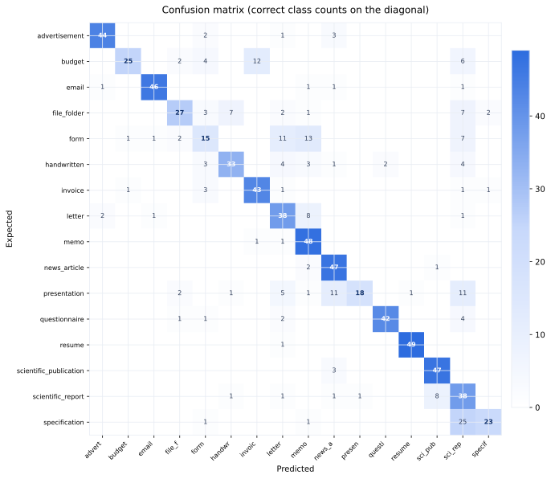

### Raw Counts

| Expected \ Predicted | `advert` | `budget` | `email` | `file_f` | `form` | `handwr` | `invoic` | `letter` | `memo` | `news_a` | `presen` | `questi` | `resume` | `scient` | `scient` | `specif` | **Total** | **Acc** |
| ---: | ---: | ---: | ---: | ---: | ---: | ---: | ---: | ---: | ---: | ---: | ---: | ---: | ---: | ---: | ---: | ---: | ---: | ---: |
| `advertisement` | **44** | . | . | . | 2 | . | . | 1 | . | 3 | . | . | . | . | . | . | 50 | 88% |
| `budget` | . | **25** | . | 2 | 4 | . | 12 | . | . | . | . | . | . | . | 6 | . | 49 | 51% |
| `email` | 1 | . | **46** | . | . | . | . | . | 1 | 1 | . | . | . | . | 1 | . | 50 | 92% |
| `file_folder` | . | . | . | **27** | 3 | 7 | . | 2 | 1 | . | . | . | . | . | 7 | 2 | 49 | 55% |
| `form` | . | 1 | 1 | 2 | **15** | . | . | 11 | 13 | . | . | . | . | . | 7 | . | 50 | 30% |
| `handwritten` | . | . | . | . | 3 | **33** | . | 4 | 3 | 1 | . | 2 | . | . | 4 | . | 50 | 66% |
| `invoice` | . | 1 | . | . | 3 | . | **43** | 1 | . | . | . | . | . | . | 1 | 1 | 50 | 86% |
| `letter` | 2 | . | 1 | . | . | . | . | **38** | 8 | . | . | . | . | . | 1 | . | 50 | 76% |
| `memo` | . | . | . | . | . | . | 1 | 1 | **48** | . | . | . | . | . | . | . | 50 | 96% |
| `news_article` | . | . | . | . | . | . | . | . | 2 | **47** | . | . | . | 1 | . | . | 50 | 94% |
| `presentation` | . | . | . | 2 | . | 1 | . | 5 | 1 | 11 | **18** | . | 1 | . | 11 | . | 50 | 36% |
| `questionnaire` | . | . | . | 1 | 1 | . | . | 2 | . | . | . | **42** | . | . | 4 | . | 50 | 84% |
| `resume` | . | . | . | . | . | . | . | 1 | . | . | . | . | **49** | . | . | . | 50 | 98% |
| `scientific_publication` | . | . | . | . | . | . | . | . | . | 3 | . | . | . | **47** | . | . | 50 | 94% |
| `scientific_report` | . | . | . | . | . | 1 | . | 1 | . | 1 | 1 | . | . | 8 | **38** | . | 50 | 76% |
| `specification` | . | . | . | . | 1 | . | . | . | 1 | . | . | . | . | . | 25 | **23** | 50 | 46% |

### Top Confused Pairs

| Expected | Predicted As | Count |
| ---------- | ------------- | ------: |
| `specification` | `scientific_report` | 25 |
| `form` | `memo` | 13 |
| `budget` | `invoice` | 12 |
| `form` | `letter` | 11 |
| `presentation` | `news_article` | 11 |
| `presentation` | `scientific_report` | 11 |
| `letter` | `memo` | 8 |
| `scientific_report` | `scientific_publication` | 8 |
| `file_folder` | `handwritten` | 7 |
| `file_folder` | `scientific_report` | 7 |
| `form` | `scientific_report` | 7 |
| `budget` | `scientific_report` | 6 |
| `presentation` | `letter` | 5 |
| `budget` | `form` | 4 |
| `handwritten` | `letter` | 4 |
| `handwritten` | `scientific_report` | 4 |
| `questionnaire` | `scientific_report` | 4 |
| `advertisement` | `news_article` | 3 |
| `file_folder` | `form` | 3 |
| `handwritten` | `form` | 3 |

## Confusion Matrix — main-1785277280

## Confusion Matrix — main-1785277280

**Overall Accuracy:** 83.8% (134/160)  
**Dataset:** 2550×3300 padded PNGs, 50 per class  
**Model:** `google/gemini-2.5-flash`

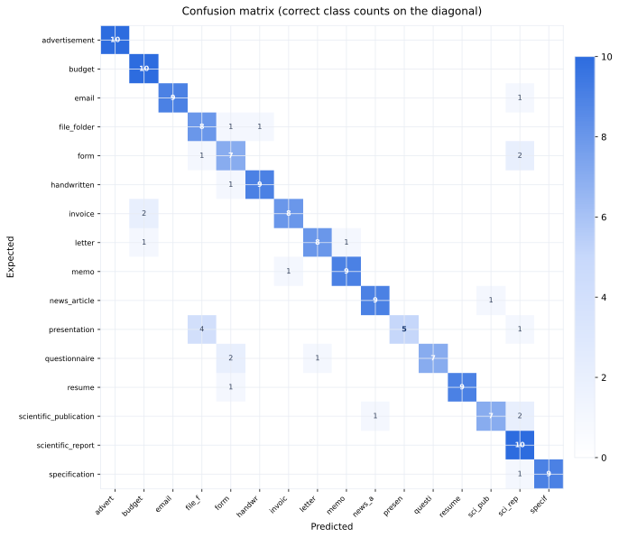

### Raw Counts

| Expected \ Predicted | `advert` | `budget` | `email` | `file_f` | `form` | `handwr` | `invoic` | `letter` | `memo` | `news_a` | `presen` | `questi` | `resume` | `scient` | `scient` | `specif` | **Total** | **Acc** |
| ---: | ---: | ---: | ---: | ---: | ---: | ---: | ---: | ---: | ---: | ---: | ---: | ---: | ---: | ---: | ---: | ---: | ---: | ---: |
| `advertisement` | **10** | . | . | . | . | . | . | . | . | . | . | . | . | . | . | . | 10 | 100% |
| `budget` | . | **10** | . | . | . | . | . | . | . | . | . | . | . | . | . | . | 10 | 100% |
| `email` | . | . | **9** | . | . | . | . | . | . | . | . | . | . | . | 1 | . | 10 | 90% |
| `file_folder` | . | . | . | **8** | 1 | 1 | . | . | . | . | . | . | . | . | . | . | 10 | 80% |
| `form` | . | . | . | 1 | **7** | . | . | . | . | . | . | . | . | . | 2 | . | 10 | 70% |
| `handwritten` | . | . | . | . | 1 | **9** | . | . | . | . | . | . | . | . | . | . | 10 | 90% |
| `invoice` | . | 2 | . | . | . | . | **8** | . | . | . | . | . | . | . | . | . | 10 | 80% |
| `letter` | . | 1 | . | . | . | . | . | **8** | 1 | . | . | . | . | . | . | . | 10 | 80% |
| `memo` | . | . | . | . | . | . | 1 | . | **9** | . | . | . | . | . | . | . | 10 | 90% |
| `news_article` | . | . | . | . | . | . | . | . | . | **9** | . | . | . | 1 | . | . | 10 | 90% |
| `presentation` | . | . | . | 4 | . | . | . | . | . | . | **5** | . | . | . | 1 | . | 10 | 50% |
| `questionnaire` | . | . | . | . | 2 | . | . | 1 | . | . | . | **7** | . | . | . | . | 10 | 70% |
| `resume` | . | . | . | . | 1 | . | . | . | . | . | . | . | **9** | . | . | . | 10 | 90% |
| `scientific_publication` | . | . | . | . | . | . | . | . | . | 1 | . | . | . | **7** | 2 | . | 10 | 70% |
| `scientific_report` | . | . | . | . | . | . | . | . | . | . | . | . | . | . | **10** | . | 10 | 100% |
| `specification` | . | . | . | . | . | . | . | . | . | . | . | . | . | . | 1 | **9** | 10 | 90% |

### Top Confused Pairs

| Expected | Predicted As | Count |
| ---------- | ------------- | ------: |
| `presentation` | `file_folder` | 4 |
| `form` | `scientific_report` | 2 |
| `invoice` | `budget` | 2 |
| `questionnaire` | `form` | 2 |
| `scientific_publication` | `scientific_report` | 2 |
| `email` | `scientific_report` | 1 |
| `file_folder` | `form` | 1 |
| `file_folder` | `handwritten` | 1 |
| `form` | `file_folder` | 1 |
| `handwritten` | `form` | 1 |
| `letter` | `budget` | 1 |
| `letter` | `memo` | 1 |
| `memo` | `invoice` | 1 |
| `news_article` | `scientific_publication` | 1 |
| `presentation` | `scientific_report` | 1 |
| `questionnaire` | `letter` | 1 |
| `resume` | `form` | 1 |
| `scientific_publication` | `news_article` | 1 |
| `specification` | `scientific_report` | 1 |
