
Full per-experiment reports: exact-match accuracy, token usage, expected-vs-actual cost with scale-up projections, per-class accuracy, and confusion-matrix links.

## Braintrust Experiment Report — gemini-2.5-flash-lite_v11_8_reasoning_160-d558f2bc

## Braintrust Experiment Report — gemini-2.5-flash-lite_v11_8_reasoning_160-d558f2bc

**Model:** `google/gemini-2.5-flash-lite`  
**Prompt version:** `v11.8`  
**Dataset:** `fixed_size_sampled` (10 per class × 16 classes = 160 images)  
**Image size:** 1024x1024  
**Reasoning:** effort=max, temperature=0.2  
**Max concurrency:** 8  

### Results

| Metric | Value |
|--------|------:|
| **Accuracy (exact_match)** | **86.88%** (139/160) |
| Scored rows | 160 |
| Failed/empty rows | 0 |
| Total expected rows | 160 |
| Prompt tokens (avg) | 6,591.8 |
| Prompt cached tokens (avg) | 4,372.6 |
| Completion tokens (avg) | 1,177.3 |
| Completion reasoning tokens (avg) | 1,005.3 |
| Total tokens (avg) | 7,769.1 |
| Time to first token (avg) | 6.99s |
| Duration (avg) | 0.00s |
| Evaluation failures | 0 |

### Cost — Expected vs Actual

**List pricing:** $0.1/M input tokens, $0.4/M output tokens (`google/gemini-2.5-flash-lite`, per OpenRouter model listing). Cached input priced at 10% of input (not applicable here — `cached_tokens` is 0 across the run).

| Metric | Value |
|--------|------:|
| Total prompt tokens (measured) | 1,054,693 |
| Total completion tokens (measured) | 188,363 |
| Total tokens (measured) | 1,243,056 |
| **Expected cost** (list price × measured tokens) | **$0.1808** |
| **Actual cost** (OpenRouter billed, from Braintrust `cost` metric) | **$0.1134** |
| Difference (expected − actual) | $+0.0675 (+37.3%) |

#### Scale-up projections (list-price expected vs extrapolated actual)

| Images | Expected Cost | Estimated Actual |
|--------|--------------:|-----------------:|
| 800 | $0.90 | $0.57 |
| 25,000 | $28.25 | $17.71 |
| 320,000 | $361.63 | $226.73 |

### Per-Class Accuracy

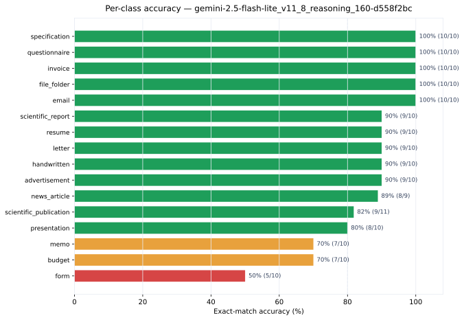

| Class | Correct | Total | Accuracy |
|-------|--------:|------:|---------:|
| `advertisement` | 9 | 10 | 90% |
| `budget` | 7 | 10 | 70% |
| `email` | 10 | 10 | 100% |
| `file_folder` | 10 | 10 | 100% |
| `form` | 5 | 10 | 50% |
| `handwritten` | 9 | 10 | 90% |
| `invoice` | 10 | 10 | 100% |
| `letter` | 9 | 10 | 90% |
| `memo` | 7 | 10 | 70% |
| `news_article` | 8 | 9 | 89% |
| `presentation` | 8 | 10 | 80% |
| `questionnaire` | 10 | 10 | 100% |
| `resume` | 9 | 10 | 90% |
| `scientific_publication` | 9 | 11 | 82% |
| `scientific_report` | 9 | 10 | 90% |
| `specification` | 10 | 10 | 100% |

### Confusion Matrix & Misclassification Analysis

- [Confusion matrix markdown](../results/confusion-matrices.html)
  - [Confusion matrix heatmap](../charts/confusion_matrix_gemini-2.5-flash-lite_v11_8_reasoning_160-d558f2bc.svg)
- [Misclassification reasoning traces](../appendix/misclassifications.html)

## Braintrust Experiment Report — qwen3.5-35b-a3b_v11_8_reasoning_160

## Braintrust Experiment Report — qwen3.5-35b-a3b_v11_8_reasoning_160

**Model:** `qwen/qwen3.5-35b-a3b`  
**Prompt version:** `v11.8`  
**Dataset:** `fixed_size_sampled` (10 per class × 16 classes = 157 images)  
**Image size:** 1024x1024  
**Reasoning:** effort=high  
**Max concurrency:** 8  

### Results

| Metric | Value |
|--------|------:|
| **Accuracy (exact_match)** | **98.73%** (155/157) |
| Scored rows | 157 |
| Failed/empty rows | 3 |
| Total expected rows | 160 |
| Prompt tokens (avg) | 11,978.9 |
| Prompt cached tokens (avg) | 2,811.5 |
| Completion tokens (avg) | 2,588.2 |
| Completion reasoning tokens (avg) | 2,191.5 |
| Total tokens (avg) | 14,567.1 |
| Time to first token (avg) | 23.11s |
| Duration (avg) | 0.00s |
| Evaluation failures | 3 |

### Cost — Expected vs Actual

**List pricing:** $0.14/M input tokens, $1.0/M output tokens (`qwen/qwen3.5-35b-a3b`, per OpenRouter model listing). Cached input priced at 10% of input (not applicable here — `cached_tokens` is 0 across the run).

| Metric | Value |
|--------|------:|
| Total prompt tokens (measured) | 1,880,682 |
| Total completion tokens (measured) | 406,354 |
| Total tokens (measured) | 2,287,036 |
| **Expected cost** (list price × measured tokens) | **$0.6696** |
| **Actual cost** (OpenRouter billed, from Braintrust `cost` metric) | **$0.8280** |
| Difference (expected − actual) | $-0.1584 (-23.7%) |

#### Scale-up projections (list-price expected vs extrapolated actual)

| Images | Expected Cost | Estimated Actual |
|--------|--------------:|-----------------:|
| 800 | $3.41 | $4.22 |
| 25,000 | $106.63 | $131.85 |
| 320,000 | $1364.89 | $1687.74 |

### Per-Class Accuracy

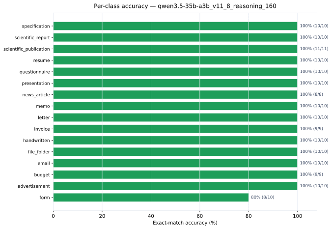

| Class | Correct | Total | Accuracy |
|-------|--------:|------:|---------:|
| `advertisement` | 10 | 10 | 100% |
| `budget` | 9 | 9 | 100% |
| `email` | 10 | 10 | 100% |
| `file_folder` | 10 | 10 | 100% |
| `form` | 8 | 10 | 80% |
| `handwritten` | 10 | 10 | 100% |
| `invoice` | 9 | 9 | 100% |
| `letter` | 10 | 10 | 100% |
| `memo` | 10 | 10 | 100% |
| `news_article` | 8 | 8 | 100% |
| `presentation` | 10 | 10 | 100% |
| `questionnaire` | 10 | 10 | 100% |
| `resume` | 10 | 10 | 100% |
| `scientific_publication` | 11 | 11 | 100% |
| `scientific_report` | 10 | 10 | 100% |
| `specification` | 10 | 10 | 100% |

### Confusion Matrix & Misclassification Analysis

- [Confusion matrix markdown](../results/confusion-matrices.html)
  - [Confusion matrix heatmap](../charts/confusion_matrix_qwen3.5-35b-a3b_v11_8_reasoning_160.svg)
- [Misclassification reasoning traces](../appendix/misclassifications.html)

## Braintrust Experiment Report — qwen3.5-35b-a3b_v11_8_reasoning_v12retro

## Braintrust Experiment Report — qwen3.5-35b-a3b_v11_8_reasoning_v12retro

**Model:** `qwen/qwen3.5-35b-a3b`  
**Prompt version:** `v11.8`  
**Dataset:** `qwen_v12_retroactive_eval` (3 per class × 16 classes = 52 images)  
**Image size:** 1024x1024  
**Reasoning:** effort=high  
**Max concurrency:** 8  

### Results

| Metric | Value |
|--------|------:|
| **Accuracy (exact_match)** | **30.77%** (16/52) |
| Scored rows | 52 |
| Failed/empty rows | 0 |
| Total expected rows | 52 |
| Prompt tokens (avg) | 11,989.0 |
| Prompt cached tokens (avg) | 10,600.6 |
| Completion tokens (avg) | 5,034.0 |
| Completion reasoning tokens (avg) | 4,561.3 |
| Total tokens (avg) | 17,023.0 |
| Time to first token (avg) | 40.09s |
| Duration (avg) | 0.00s |
| Evaluation failures | 0 |

### Cost — Expected vs Actual

**List pricing:** $0.14/M input tokens, $1.0/M output tokens (`qwen/qwen3.5-35b-a3b`, per OpenRouter model listing). Cached input priced at 10% of input (not applicable here — `cached_tokens` is 0 across the run).

| Metric | Value |
|--------|------:|
| Total prompt tokens (measured) | 623,428 |
| Total completion tokens (measured) | 261,770 |
| Total tokens (measured) | 885,198 |
| **Expected cost** (list price × measured tokens) | **$0.3490** |
| **Actual cost** (OpenRouter billed, from Braintrust `cost` metric) | **$0.4359** |
| Difference (expected − actual) | $-0.0869 (-24.9%) |

#### Scale-up projections (list-price expected vs extrapolated actual)

| Images | Expected Cost | Estimated Actual |
|--------|--------------:|-----------------:|
| 800 | $5.37 | $6.71 |
| 25,000 | $167.81 | $209.57 |
| 320,000 | $2148.00 | $2682.48 |

### Per-Class Accuracy

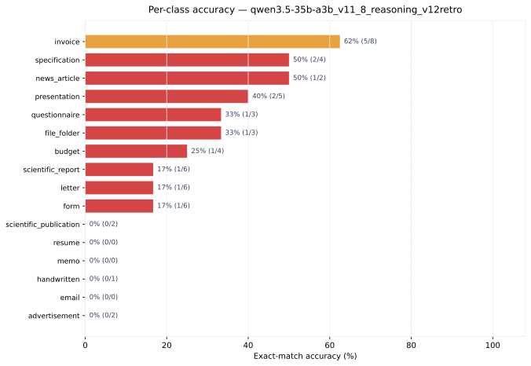

| Class | Correct | Total | Accuracy |
|-------|--------:|------:|---------:|
| `advertisement` | 0 | 2 | 0% |
| `budget` | 1 | 4 | 25% |
| `email` | 0 | 0 | — |
| `file_folder` | 1 | 3 | 33% |
| `form` | 1 | 6 | 17% |
| `handwritten` | 0 | 1 | 0% |
| `invoice` | 5 | 8 | 62% |
| `letter` | 1 | 6 | 17% |
| `memo` | 0 | 0 | — |
| `news_article` | 1 | 2 | 50% |
| `presentation` | 2 | 5 | 40% |
| `questionnaire` | 1 | 3 | 33% |
| `resume` | 0 | 0 | — |
| `scientific_publication` | 0 | 2 | 0% |
| `scientific_report` | 1 | 6 | 17% |
| `specification` | 2 | 4 | 50% |

### Confusion Matrix & Misclassification Analysis

- [Confusion matrix markdown](../results/confusion-matrices.html)
  - [Confusion matrix heatmap](../charts/confusion_matrix_qwen3.5-35b-a3b_v11_8_reasoning_v12retro.svg)
- [Misclassification reasoning traces](../appendix/misclassifications.html)

## Braintrust Experiment Report — qwen3.7-flash_v0_reasoning_480-d4c97ff0

## Braintrust Experiment Report — qwen3.7-flash_v0_reasoning_480-d4c97ff0

**Model:** `qwen/qwen3.7-flash`  
**Prompt version:** `v0`  
**Dataset:** `fixed_size_sampled_480` (30 per class × 16 classes = 480 images)  
**Image size:** 1024x1024  
**Reasoning:** enabled (effort=high), trace logged  
**Max concurrency:** 8  

### Results

| Metric | Value |
|--------|------:|
| **Accuracy (exact_match)** | **69.17%** (332/480) |
| Scored rows | 480 |
| Failed/empty rows | 0 |
| Total expected rows | 480 |
| Prompt tokens (avg) | 525.4 |
| Prompt cached tokens (avg) | 0.0 |
| Completion tokens (avg) | 1,241.4 |
| Completion reasoning tokens (avg) | 1,150.8 |
| Total tokens (avg) | 1,766.8 |
| Time to first token (avg) | 30.61s |
| Duration (avg) | 0.00s |
| Evaluation failures | 0 |

### Cost — Expected vs Actual

**List pricing:** $0.03/M input tokens, $0.13/M output tokens (`qwen/qwen3.7-flash`, per OpenRouter model listing). Cached input priced at 10% of input (not applicable here — `cached_tokens` is 0 across the run).

| Metric | Value |
|--------|------:|
| Total prompt tokens (measured) | 252,208 |
| Total completion tokens (measured) | 595,855 |
| Total tokens (measured) | 848,063 |
| **Expected cost** (list price × measured tokens) | **$0.0850** |
| **Actual cost** (OpenRouter billed, from Braintrust `cost` metric) | **$0.0846** |
| Difference (expected − actual) | $+0.0004 (+0.5%) |

#### Scale-up projections (list-price expected vs extrapolated actual)

| Images | Expected Cost | Estimated Actual |
|--------|--------------:|-----------------:|
| 800 | $0.14 | $0.14 |
| 25,000 | $4.43 | $4.41 |
| 320,000 | $56.68 | $56.39 |

### Per-Class Accuracy

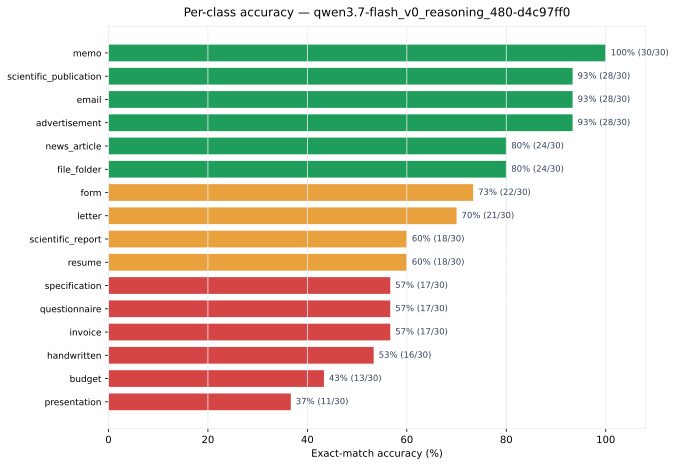

| Class | Correct | Total | Accuracy |
|-------|--------:|------:|---------:|
| `advertisement` | 28 | 30 | 93% |
| `budget` | 13 | 30 | 43% |
| `email` | 28 | 30 | 93% |
| `file_folder` | 24 | 30 | 80% |
| `form` | 22 | 30 | 73% |
| `handwritten` | 16 | 30 | 53% |
| `invoice` | 17 | 30 | 57% |
| `letter` | 21 | 30 | 70% |
| `memo` | 30 | 30 | 100% |
| `news_article` | 24 | 30 | 80% |
| `presentation` | 11 | 30 | 37% |
| `questionnaire` | 17 | 30 | 57% |
| `resume` | 18 | 30 | 60% |
| `scientific_publication` | 28 | 30 | 93% |
| `scientific_report` | 18 | 30 | 60% |
| `specification` | 17 | 30 | 57% |

### Confusion Matrix & Misclassification Analysis

- [Confusion matrix markdown](../results/confusion-matrices.html)
  - [Confusion matrix heatmap](../charts/confusion_matrix_qwen3.7-flash_v0_reasoning_480-d4c97ff0.svg)
- [Misclassification reasoning traces](../appendix/misclassifications.html)

## Braintrust Experiment Report — qwen3.7-flash_v0_reasoning_800-f0b6b2e4

## Braintrust Experiment Report — qwen3.7-flash_v0_reasoning_800-f0b6b2e4

**Model:** `qwen/qwen3.7-flash`  
**Prompt version:** `v0`  
**Dataset:** `rvl_cdip_800` (50 per class × 16 classes = 800 images)  
**Image size:** 1024x1024  
**Reasoning:** enabled (effort=high), trace logged  
**Max concurrency:** 8  

### Results

| Metric | Value |
|--------|------:|
| **Accuracy (exact_match)** | **66.12%** (529/800) |
| Scored rows | 800 |
| Failed/empty rows | 0 |
| Total expected rows | 800 |
| Prompt tokens (avg) | 741.1 |
| Prompt cached tokens (avg) | 0.0 |
| Completion tokens (avg) | 1,552.1 |
| Completion reasoning tokens (avg) | 1,491.1 |
| Total tokens (avg) | 2,293.1 |
| Time to first token (avg) | 39.53s |
| Duration (avg) | 0.00s |
| Evaluation failures | 0 |

### Cost — Expected vs Actual

**List pricing:** $0.03/M input tokens, $0.13/M output tokens (`qwen/qwen3.7-flash`, per OpenRouter model listing). Cached input priced at 10% of input (not applicable here — `cached_tokens` is 0 across the run).

| Metric | Value |
|--------|------:|
| Total prompt tokens (measured) | 592,847 |
| Total completion tokens (measured) | 1,241,656 |
| Total tokens (measured) | 1,834,503 |
| **Expected cost** (list price × measured tokens) | **$0.1792** |
| **Actual cost** (OpenRouter billed, from Braintrust `cost` metric) | **$0.1773** |
| Difference (expected − actual) | $+0.0019 (+1.1%) |

#### Scale-up projections (list-price expected vs extrapolated actual)

| Images | Expected Cost | Estimated Actual |
|--------|--------------:|-----------------:|
| 800 | $0.18 | $0.18 |
| 25,000 | $5.60 | $5.54 |
| 320,000 | $71.68 | $70.92 |

### Per-Class Accuracy

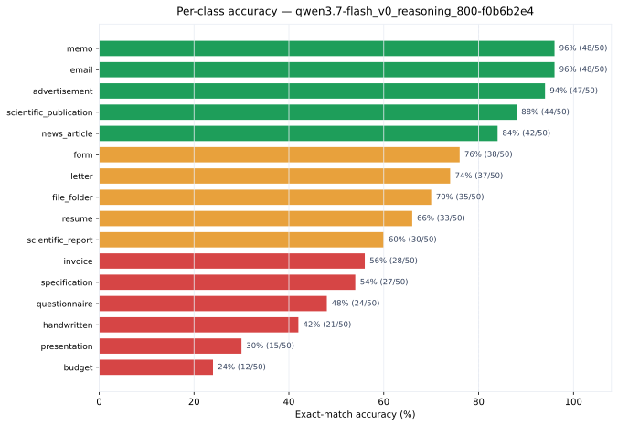

| Class | Correct | Total | Accuracy |
|-------|--------:|------:|---------:|
| `advertisement` | 47 | 50 | 94% |
| `budget` | 12 | 50 | 24% |
| `email` | 48 | 50 | 96% |
| `file_folder` | 35 | 50 | 70% |
| `form` | 38 | 50 | 76% |
| `handwritten` | 21 | 50 | 42% |
| `invoice` | 28 | 50 | 56% |
| `letter` | 37 | 50 | 74% |
| `memo` | 48 | 50 | 96% |
| `news_article` | 42 | 50 | 84% |
| `presentation` | 15 | 50 | 30% |
| `questionnaire` | 24 | 50 | 48% |
| `resume` | 33 | 50 | 66% |
| `scientific_publication` | 44 | 50 | 88% |
| `scientific_report` | 30 | 50 | 60% |
| `specification` | 27 | 50 | 54% |

### Confusion Matrix & Misclassification Analysis

- [Confusion matrix markdown](../results/confusion-matrices.html)
  - [Confusion matrix heatmap](../charts/confusion_matrix_qwen3.7-flash_v0_reasoning_800-f0b6b2e4.svg)
- [Misclassification reasoning traces](../appendix/misclassifications.html)

## Braintrust Experiment Report — qwen3.7-flash_v11.8_reasoning_800-f6f4648b

## Braintrust Experiment Report — qwen3.7-flash_v11.8_reasoning_800-f6f4648b

**Model:** `qwen/qwen3.7-flash`  
**Prompt version:** `v11.8`  
**Dataset:** `rvl_cdip_800` (50 per class × 16 classes = 800 images)  
**Image size:** 1024x1024  
**Reasoning:** enabled (effort=high), trace logged  
**Max concurrency:** 8  

### Results

| Metric | Value |
|--------|------:|
| **Accuracy (exact_match)** | **83.12%** (665/800) |
| Scored rows | 800 |
| Failed/empty rows | 0 |
| Total expected rows | 800 |
| Prompt tokens (avg) | 11,986.0 |
| Prompt cached tokens (avg) | 7,325.6 |
| Completion tokens (avg) | 1,906.5 |
| Completion reasoning tokens (avg) | 1,559.2 |
| Total tokens (avg) | 13,892.5 |
| Time to first token (avg) | 47.31s |
| Duration (avg) | 0.00s |
| Evaluation failures | 0 |

### Cost — Expected vs Actual

**List pricing:** $0.03/M input tokens, $0.13/M output tokens (`qwen/qwen3.7-flash`, per OpenRouter model listing). Cached input priced at 10% of input — this run had heavy prompt caching (7,326 avg cached tokens/image, ~61% of prompt tokens), so expected cost below applies the cache discount to cached tokens.

> Note: token/cost metrics are measured from the original run (experiment `qwen3.7-flash_v11.8_reasoning_800`); the final resume run's spans logged no usage because 797/800 rows were manifest-cache hits.

| Metric | Value |
|--------|------:|
| Total prompt tokens (measured) | 9,588,811 |
| &nbsp;&nbsp;of which cached (10% rate) | 5,860,992 |
| Total completion tokens (measured) | 1,524,217 |
| Total tokens (measured) | 11,113,028 |
| **Expected cost** (cache-adjusted list price × measured tokens) | **$0.3276** |
| **Actual cost** (OpenRouter billed, from Braintrust `cost` metric) | **$0.3427** |
| Difference (expected − actual) | $+0.0151 (+4.6%) |

#### Scale-up projections (cache-adjusted list-price expected vs extrapolated actual)

| Images | Expected Cost | Estimated Actual |
|--------|--------------:|-----------------:|
| 800 | $0.33 | $0.34 |
| 25,000 | $10.24 | $10.71 |
| 320,000 | $131.04 | $137.08 |

### Per-Class Accuracy

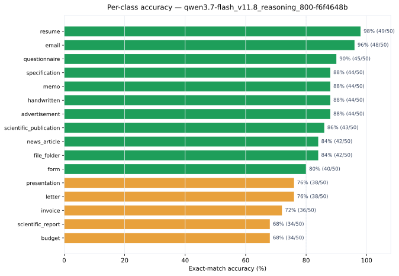

| Class | Correct | Total | Accuracy |
|-------|--------:|------:|---------:|
| `advertisement` | 44 | 50 | 88% |
| `budget` | 34 | 50 | 68% |
| `email` | 48 | 50 | 96% |
| `file_folder` | 42 | 50 | 84% |
| `form` | 40 | 50 | 80% |
| `handwritten` | 44 | 50 | 88% |
| `invoice` | 36 | 50 | 72% |
| `letter` | 38 | 50 | 76% |
| `memo` | 44 | 50 | 88% |
| `news_article` | 42 | 50 | 84% |
| `presentation` | 38 | 50 | 76% |
| `questionnaire` | 45 | 50 | 90% |
| `resume` | 49 | 50 | 98% |
| `scientific_publication` | 43 | 50 | 86% |
| `scientific_report` | 34 | 50 | 68% |
| `specification` | 44 | 50 | 88% |

### Confusion Matrix & Misclassification Analysis

- [Confusion matrix markdown](../results/confusion-matrices.html)
  - [Confusion matrix heatmap](../charts/confusion_matrix_qwen3.7-flash_v11.8_reasoning_800-f6f4648b.svg)
- [Misclassification reasoning traces](../appendix/misclassifications.html)

## Braintrust Experiment Report — qwen3.7-flash_v11_7_reasoning_160

## Braintrust Experiment Report — qwen3.7-flash_v11_7_reasoning_160

**Model:** `qwen/qwen3.7-flash`  
**Prompt version:** `v11.7`  
**Dataset:** `fixed_size_sampled` (10 per class × 16 classes = 159 images)  
**Image size:** 1024x1024  
**Reasoning:** enabled (effort=high), trace logged  
**Max concurrency:** 8  

### Results

| Metric | Value |
|--------|------:|
| **Accuracy (exact_match)** | **98.11%** (156/159) |
| Prompt tokens (avg) | 11,779.1 |
| Prompt cached tokens (avg) | 7,415.1 |
| Completion tokens (avg) | 1,726.8 |
| Completion reasoning tokens (avg) | 1,390.1 |
| Total tokens (avg) | 13,505.9 |
| Time to first token (avg) | 40.11s |
| Duration (avg) | 0.00s |
| Errors | 1 |

### Cost — Expected vs Actual

**List pricing:** $0.03/M input tokens, $0.13/M output tokens (`qwen/qwen3.7-flash`, per OpenRouter model listing). Cached input priced at 10% of input (not applicable here — `cached_tokens` is 0 across the run).

| Metric | Value |
|--------|------:|
| Total prompt tokens (measured) | 1,872,879 |
| Total completion tokens (measured) | 274,556 |
| Total tokens (measured) | 2,147,435 |
| **Expected cost** (list price × measured tokens) | **$0.0919** |
| **Actual cost** (OpenRouter billed, from Braintrust `cost` metric) | **$0.0627** |
| Difference (expected − actual) | $+0.0292 (+31.8%) |

#### Scale-up projections (list-price expected vs extrapolated actual)

| Images | Expected Cost | Estimated Actual |
|--------|--------------:|-----------------:|
| 800 | $0.46 | $0.32 |
| 25,000 | $14.45 | $9.86 |
| 320,000 | $184.91 | $126.17 |

### Per-Class Accuracy

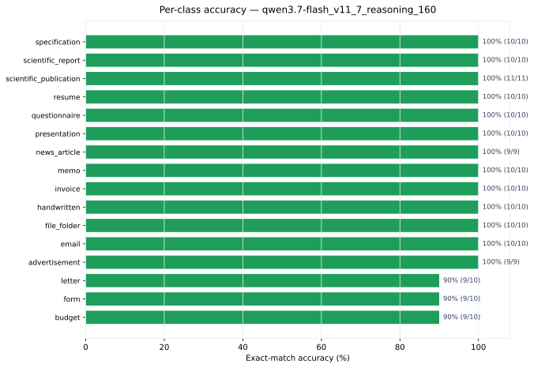

| Class | Correct | Total | Accuracy |
|-------|--------:|------:|---------:|
| `advertisement` | 9 | 9 | 100% |
| `budget` | 9 | 10 | 90% |
| `email` | 10 | 10 | 100% |
| `file_folder` | 10 | 10 | 100% |
| `form` | 9 | 10 | 90% |
| `handwritten` | 10 | 10 | 100% |
| `invoice` | 10 | 10 | 100% |
| `letter` | 9 | 10 | 90% |
| `memo` | 10 | 10 | 100% |
| `news_article` | 9 | 9 | 100% |
| `presentation` | 10 | 10 | 100% |
| `questionnaire` | 10 | 10 | 100% |
| `resume` | 10 | 10 | 100% |
| `scientific_publication` | 11 | 11 | 100% |
| `scientific_report` | 10 | 10 | 100% |
| `specification` | 10 | 10 | 100% |

### Confusion Matrix & Misclassification Analysis

- [Confusion matrix markdown](../results/confusion-matrices.html)
  - [Confusion matrix heatmap](../charts/confusion_matrix_qwen3.7-flash_v11_7_reasoning_160.svg)
- [Misclassification reasoning traces](../appendix/misclassifications.html)

## Braintrust Experiment Report — qwen3.7-flash_v11_8_reasoning_160_t0_3

## Braintrust Experiment Report — qwen3.7-flash_v11_8_reasoning_160_t0_3

**Model:** `qwen/qwen3.7-flash`  
**Prompt version:** `v11.8`  
**Dataset:** `fixed_size_sampled` (10 per class × 16 classes = 159 images)  
**Image size:** 1024x1024  
**Reasoning:** effort=high, temperature=0.3  
**Max concurrency:** 8  

### Results

| Metric | Value |
|--------|------:|
| **Accuracy (exact_match)** | **98.74%** (157/159) |
| Scored rows | 159 |
| Failed/empty rows | 1 |
| Total expected rows | 160 |
| Prompt tokens (avg) | 12,013.2 |
| Prompt cached tokens (avg) | 5,696.4 |
| Completion tokens (avg) | 1,712.5 |
| Completion reasoning tokens (avg) | 1,380.2 |
| Total tokens (avg) | 13,725.6 |
| Time to first token (avg) | 40.71s |
| Duration (avg) | 0.00s |
| Evaluation failures | 1 |

### Cost — Expected vs Actual

**List pricing:** $0.03/M input tokens, $0.13/M output tokens (`qwen/qwen3.7-flash`, per OpenRouter model listing). Cached input priced at 10% of input (not applicable here — `cached_tokens` is 0 across the run).

| Metric | Value |
|--------|------:|
| Total prompt tokens (measured) | 1,910,091 |
| Total completion tokens (measured) | 272,284 |
| Total tokens (measured) | 2,182,375 |
| **Expected cost** (list price × measured tokens) | **$0.0927** |
| **Actual cost** (OpenRouter billed, from Braintrust `cost` metric) | **$0.0700** |
| Difference (expected − actual) | $+0.0227 (+24.5%) |

#### Scale-up projections (list-price expected vs extrapolated actual)

| Images | Expected Cost | Estimated Actual |
|--------|--------------:|-----------------:|
| 800 | $0.47 | $0.35 |
| 25,000 | $14.58 | $11.00 |
| 320,000 | $186.57 | $140.84 |

### Per-Class Accuracy

| Class | Correct | Total | Accuracy |
|-------|--------:|------:|---------:|
| `advertisement` | 9 | 9 | 100% |
| `budget` | 9 | 10 | 90% |
| `email` | 10 | 10 | 100% |
| `file_folder` | 10 | 10 | 100% |
| `form` | 9 | 10 | 90% |
| `handwritten` | 10 | 10 | 100% |
| `invoice` | 10 | 10 | 100% |
| `letter` | 10 | 10 | 100% |
| `memo` | 10 | 10 | 100% |
| `news_article` | 9 | 9 | 100% |
| `presentation` | 10 | 10 | 100% |
| `questionnaire` | 10 | 10 | 100% |
| `resume` | 10 | 10 | 100% |
| `scientific_publication` | 11 | 11 | 100% |
| `scientific_report` | 10 | 10 | 100% |
| `specification` | 10 | 10 | 100% |

### Confusion Matrix & Misclassification Analysis

- [Confusion matrix markdown](../results/confusion-matrices.html)
  - [Confusion matrix heatmap](../charts/confusion_matrix_qwen3.7-flash_v11_8_reasoning_160_t0_3.svg)
- [Misclassification reasoning traces](../appendix/misclassifications.html)

## Braintrust Experiment Report — qwen3.7-flash_v11_8_reasoning_320

## Braintrust Experiment Report — qwen3.7-flash_v11_8_reasoning_320

**Model:** `qwen/qwen3.7-flash`  
**Prompt version:** `v11.8`  
**Dataset:** `fixed_size_sampled_320` (20 per class × 16 classes = 318 images)  
**Image size:** 1024x1024  
**Reasoning:** high  
**Max concurrency:** 8  

### Results

| Metric | Value |
|--------|------:|
| **Accuracy (exact_match)** | **87.11%** (277/318) |
| Scored rows | 318 |
| Failed/empty rows | 1 |
| Total expected rows | 319 |
| Prompt tokens (avg) | 12,013.2 |
| Prompt cached tokens (avg) | 7,587.0 |
| Completion tokens (avg) | 1,910.3 |
| Completion reasoning tokens (avg) | 1,560.7 |
| Total tokens (avg) | 13,923.5 |
| Time to first token (avg) | 42.61s |
| Duration (avg) | 0.00s |
| Evaluation failures | 1 |

### Cost — Expected vs Actual

**List pricing:** $0.03/M input tokens, $0.13/M output tokens (`qwen/qwen3.7-flash`, per OpenRouter model listing). Cached input priced at 10% of input (not applicable here — `cached_tokens` is 0 across the run).

| Metric | Value |
|--------|------:|
| Total prompt tokens (measured) | 3,820,182 |
| Total completion tokens (measured) | 607,490 |
| Total tokens (measured) | 4,427,672 |
| **Expected cost** (list price × measured tokens) | **$0.1936** |
| **Actual cost** (OpenRouter billed, from Braintrust `cost` metric) | **$0.1338** |
| Difference (expected − actual) | $+0.0598 (+30.9%) |

#### Scale-up projections (list-price expected vs extrapolated actual)

| Images | Expected Cost | Estimated Actual |
|--------|--------------:|-----------------:|
| 800 | $0.49 | $0.34 |
| 25,000 | $15.22 | $10.52 |
| 320,000 | $194.80 | $134.60 |

### Per-Class Accuracy

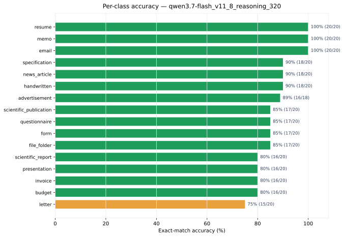

| Class | Correct | Total | Accuracy |
|-------|--------:|------:|---------:|
| `advertisement` | 16 | 18 | 89% |
| `budget` | 16 | 20 | 80% |
| `email` | 20 | 20 | 100% |
| `file_folder` | 17 | 20 | 85% |
| `form` | 17 | 20 | 85% |
| `handwritten` | 18 | 20 | 90% |
| `invoice` | 16 | 20 | 80% |
| `letter` | 15 | 20 | 75% |
| `memo` | 20 | 20 | 100% |
| `news_article` | 18 | 20 | 90% |
| `presentation` | 16 | 20 | 80% |
| `questionnaire` | 17 | 20 | 85% |
| `resume` | 20 | 20 | 100% |
| `scientific_publication` | 17 | 20 | 85% |
| `scientific_report` | 16 | 20 | 80% |
| `specification` | 18 | 20 | 90% |

### Confusion Matrix & Misclassification Analysis

- [Confusion matrix markdown](../results/confusion-matrices.html)
  - [Confusion matrix heatmap](../charts/confusion_matrix_qwen3.7-flash_v11_8_reasoning_320.svg)
- [Misclassification reasoning traces](../appendix/misclassifications.html)

## Braintrust Experiment Report — qwen3.7-flash_v11_reasoning_160

## Braintrust Experiment Report — qwen3.7-flash_v11_reasoning_160

**Model:** `qwen/qwen3.7-flash`  
**Prompt version:** `v11`  
**Dataset:** `fixed_size_sampled` (10 per class × 16 classes = 158 images)  
**Image size:** 1024x1024  
**Reasoning:** enabled (effort=high), trace logged  
**Max concurrency:** 8  

### Results

| Metric | Value |
|--------|------:|
| **Accuracy (exact_match)** | **98.73%** (156/158) |
| Prompt tokens (avg) | 11,159.6 |
| Prompt cached tokens (avg) | 8,661.9 |
| Completion tokens (avg) | 1,738.6 |
| Completion reasoning tokens (avg) | 1,407.1 |
| Total tokens (avg) | 12,898.3 |
| Time to first token (avg) | 40.63s |
| Duration (avg) | 0.00s |
| Errors | 2 |

### Cost — Expected vs Actual

**List pricing:** $0.03/M input tokens, $0.13/M output tokens (`qwen/qwen3.7-flash`, per OpenRouter model listing). Cached input priced at 10% of input (not applicable here — `cached_tokens` is 0 across the run).

| Metric | Value |
|--------|------:|
| Total prompt tokens (measured) | 1,763,221 |
| Total completion tokens (measured) | 274,706 |
| Total tokens (measured) | 2,037,927 |
| **Expected cost** (list price × measured tokens) | **$0.0886** |
| **Actual cost** (OpenRouter billed, from Braintrust `cost` metric) | **$0.0554** |
| Difference (expected − actual) | $+0.0332 (+37.5%) |

#### Scale-up projections (list-price expected vs extrapolated actual)

| Images | Expected Cost | Estimated Actual |
|--------|--------------:|-----------------:|
| 800 | $0.45 | $0.28 |
| 25,000 | $14.02 | $8.76 |
| 320,000 | $179.46 | $112.12 |

### Per-Class Accuracy

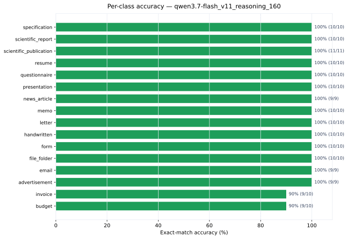

| Class | Correct | Total | Accuracy |
|-------|--------:|------:|---------:|
| `advertisement` | 9 | 9 | 100% |
| `budget` | 9 | 10 | 90% |
| `email` | 9 | 9 | 100% |
| `file_folder` | 10 | 10 | 100% |
| `form` | 10 | 10 | 100% |
| `handwritten` | 10 | 10 | 100% |
| `invoice` | 9 | 10 | 90% |
| `letter` | 10 | 10 | 100% |
| `memo` | 10 | 10 | 100% |
| `news_article` | 9 | 9 | 100% |
| `presentation` | 10 | 10 | 100% |
| `questionnaire` | 10 | 10 | 100% |
| `resume` | 10 | 10 | 100% |
| `scientific_publication` | 11 | 11 | 100% |
| `scientific_report` | 10 | 10 | 100% |
| `specification` | 10 | 10 | 100% |

### Confusion Matrix & Misclassification Analysis

- [Confusion matrix markdown](../results/confusion-matrices.html)
  - [Confusion matrix heatmap](../charts/confusion_matrix_qwen3.7-flash_v11_reasoning_160.svg)
- [Misclassification reasoning traces](../appendix/misclassifications.html)

## Braintrust Experiment Report — qwen3.7-flash_v11_reasoning_320

## Braintrust Experiment Report — qwen3.7-flash_v11_reasoning_320

**Model:** `qwen/qwen3.7-flash`  
**Prompt version:** `v11`  
**Dataset:** `fixed_size_sampled_320` (20 per class × 16 classes = 320 images)  
**Image size:** 1024x1024  
**Reasoning:** enabled (effort=high), trace logged  
**Max concurrency:** 8  

### Results

| Metric | Value |
|--------|------:|
| **Accuracy (exact_match)** | **83.81%** (264/315) |
| Prompt tokens (avg) | 11,165.5 |
| Prompt cached tokens (avg) | 8,874.7 |
| Completion tokens (avg) | 2,029.6 |
| Completion reasoning tokens (avg) | 1,680.7 |
| Total tokens (avg) | 13,195.1 |
| Time to first token (avg) | 46.27s |
| Duration (avg) | 0.00s |
| Errors | 3 |

### Cost — Expected vs Actual

**List pricing:** $0.03/M input tokens, $0.13/M output tokens (`qwen/qwen3.7-flash`, per OpenRouter model listing). Cached input priced at 10% of input (not applicable here — `cached_tokens` is 0 across the run).

| Metric | Value |
|--------|------:|
| Total prompt tokens (measured) | 3,517,131 |
| Total completion tokens (measured) | 639,337 |
| Total tokens (measured) | 4,156,468 |
| **Expected cost** (list price × measured tokens) | **$0.1886** |
| **Actual cost** (OpenRouter billed, from Braintrust `cost` metric) | **$0.1198** |
| Difference (expected − actual) | $+0.0688 (+36.5%) |

#### Scale-up projections (list-price expected vs extrapolated actual)

| Images | Expected Cost | Estimated Actual |
|--------|--------------:|-----------------:|
| 800 | $0.48 | $0.30 |
| 25,000 | $14.97 | $9.51 |
| 320,000 | $191.62 | $121.72 |

### Per-Class Accuracy

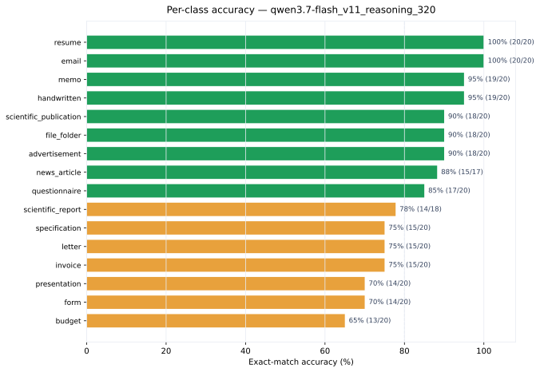

| Class | Correct | Total | Accuracy |
|-------|--------:|------:|---------:|
| `advertisement` | 18 | 20 | 90% |
| `budget` | 13 | 20 | 65% |
| `email` | 20 | 20 | 100% |
| `file_folder` | 18 | 20 | 90% |
| `form` | 14 | 20 | 70% |
| `handwritten` | 19 | 20 | 95% |
| `invoice` | 15 | 20 | 75% |
| `letter` | 15 | 20 | 75% |
| `memo` | 19 | 20 | 95% |
| `news_article` | 15 | 17 | 88% |
| `presentation` | 14 | 20 | 70% |
| `questionnaire` | 17 | 20 | 85% |
| `resume` | 20 | 20 | 100% |
| `scientific_publication` | 18 | 20 | 90% |
| `scientific_report` | 14 | 18 | 78% |
| `specification` | 15 | 20 | 75% |

### Confusion Matrix & Misclassification Analysis

- [Confusion matrix markdown](../results/confusion-matrices.html)
  - [Confusion matrix heatmap](../charts/confusion_matrix_qwen3.7-flash_v11_reasoning_320.svg)
- [Misclassification reasoning traces](../appendix/misclassifications.html)

## Braintrust Experiment Report — qwen3.7-flash_v11_smoke_full

## Braintrust Experiment Report — qwen3.7-flash_v11_smoke_full

**Model:** `qwen/qwen3.7-flash`  
**Prompt version:** `v11`  
**Dataset:** `qwen_misclassification_smoke_v1_v11` (misclassification smoke set: one image per v1–v11 miss, 239 rows; 238 scored)  
**Image size:** 1024x1024  
**Reasoning:** enabled (effort=high), trace logged  
**Max concurrency:** 8  

### Results

| Metric | Value |
|--------|------:|
| **Accuracy (exact_match)** | **87.71%** (207/236) |
| Prompt tokens (avg) | 11,155.8 |
| Prompt cached tokens (avg) | 8,922.0 |
| Completion tokens (avg) | 2,040.0 |
| Completion reasoning tokens (avg) | 1,694.0 |
| Total tokens (avg) | 13,195.8 |
| Time to first token (avg) | 47.56s |
| Duration (avg) | 0.00s |
| Errors | 1 |

### Cost — Expected vs Actual

**List pricing:** $0.03/M input tokens, $0.13/M output tokens (`qwen/qwen3.7-flash`, per OpenRouter model listing). Cached input priced at 10% of input (not applicable here — `cached_tokens` is 0 across the run).

| Metric | Value |
|--------|------:|
| Total prompt tokens (measured) | 2,632,765 |
| Total completion tokens (measured) | 481,434 |
| Total tokens (measured) | 3,114,199 |
| **Expected cost** (list price × measured tokens) | **$0.1416** |
| **Actual cost** (OpenRouter billed, from Braintrust `cost` metric) | **$0.0906** |
| Difference (expected − actual) | $+0.0510 (+36.0%) |

#### Scale-up projections (list-price expected vs extrapolated actual)

| Images | Expected Cost | Estimated Actual |
|--------|--------------:|-----------------:|
| 800 | $0.48 | $0.31 |
| 25,000 | $15.00 | $9.60 |
| 320,000 | $191.96 | $122.85 |

### Per-Class Accuracy

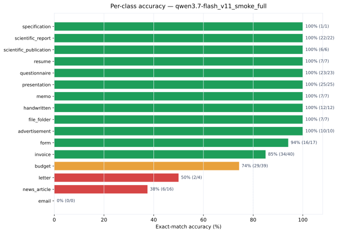

| Class | Correct | Total | Accuracy |
|-------|--------:|------:|---------:|
| `advertisement` | 10 | 10 | 100% |
| `budget` | 29 | 39 | 74% |
| `email` | 0 | 0 | — |
| `file_folder` | 7 | 7 | 100% |
| `form` | 16 | 17 | 94% |
| `handwritten` | 12 | 12 | 100% |
| `invoice` | 34 | 40 | 85% |
| `letter` | 2 | 4 | 50% |
| `memo` | 7 | 7 | 100% |
| `news_article` | 6 | 16 | 38% |
| `presentation` | 25 | 25 | 100% |
| `questionnaire` | 23 | 23 | 100% |
| `resume` | 7 | 7 | 100% |
| `scientific_publication` | 6 | 6 | 100% |
| `scientific_report` | 22 | 22 | 100% |
| `specification` | 1 | 1 | 100% |

### Confusion Matrix & Misclassification Analysis

- [Confusion matrix markdown](../results/confusion-matrices.html)
  - [Confusion matrix heatmap](../charts/confusion_matrix_qwen3.7-flash_v11_smoke_full.svg)
- [Misclassification reasoning traces](../appendix/misclassifications.html)

## Braintrust Experiment Report — qwen3.7-flash_v14_reasoning_160_v2_retry

## Braintrust Experiment Report — qwen3.7-flash_v14_reasoning_160_v2_retry

**Model:** `qwen/qwen3.7-flash`
**Prompt version:** `v14`
**Dataset:** `fixed_size_sampled_v2` (10 per class × 16 classes = 160 images)
**Image size:** 1024x1024
**Reasoning:** enabled (effort=high), trace logged
**Max concurrency:** 8

### Results

| Metric | Value |
|--------|------:|
| **Accuracy (exact_match)** | **85.00%** (136/160) |
| Scored rows | 160 |
| Failed/empty rows | 0 |
| Total expected rows | 160 |
| Prompt tokens (avg) | 12,959.8 |
| Prompt cached tokens (avg) | 7,164.8 |
| Completion tokens (avg) | 2,551.5 |
| Completion reasoning tokens (avg) | 2,173.1 |
| Total tokens (avg) | 15,511.3 |
| Time to first token (avg) | 54.75s |
| Duration (avg) | 0.00s |
| Evaluation failures | 0 |

### Cost — Expected vs Actual

**List pricing:** $0.03/M input tokens, $0.13/M output tokens (`qwen/qwen3.7-flash`, per OpenRouter model listing). Cached input priced at 10% of input (not applicable here — `cached_tokens` is 0 across the run).

| Metric | Value |
|--------|------:|
| Total prompt tokens (measured) | 2,073,572 |
| Total completion tokens (measured) | 408,242 |
| Total tokens (measured) | 2,481,814 |
| **Expected cost** (list price × measured tokens) | **$0.1153** |
| **Actual cost** (OpenRouter billed, from Braintrust `cost` metric) | **$0.0864** |
| Difference (expected − actual) | $+0.0289 (+25.1%) |

#### Scale-up projections (list-price expected vs extrapolated actual)

| Images | Expected Cost | Estimated Actual |
|--------|--------------:|-----------------:|
| 800 | $0.58 | $0.43 |
| 25,000 | $18.01 | $13.50 |
| 320,000 | $230.56 | $172.75 |

### Per-Class Accuracy

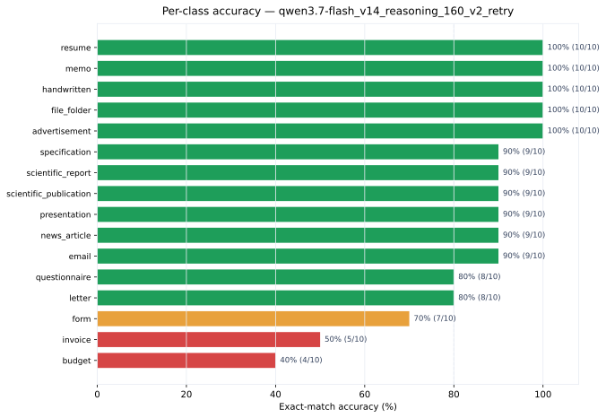

| Class | Correct | Total | Accuracy |
|-------|--------:|------:|---------:|
| `advertisement` | 10 | 10 | 100% |
| `budget` | 4 | 10 | 40% |
| `email` | 9 | 10 | 90% |
| `file_folder` | 10 | 10 | 100% |
| `form` | 7 | 10 | 70% |
| `handwritten` | 10 | 10 | 100% |
| `invoice` | 5 | 10 | 50% |
| `letter` | 8 | 10 | 80% |
| `memo` | 10 | 10 | 100% |
| `news_article` | 9 | 10 | 90% |
| `presentation` | 9 | 10 | 90% |
| `questionnaire` | 8 | 10 | 80% |
| `resume` | 10 | 10 | 100% |
| `scientific_publication` | 9 | 10 | 90% |
| `scientific_report` | 9 | 10 | 90% |
| `specification` | 9 | 10 | 90% |

### Confusion Matrix & Misclassification Analysis

- [Confusion matrix markdown](../results/confusion-matrices.html)
  - [Confusion matrix heatmap](../charts/confusion_matrix_qwen3.7-flash_v14_reasoning_160_v2_retry.svg)
- [Misclassification reasoning traces](../appendix/misclassifications.html)
