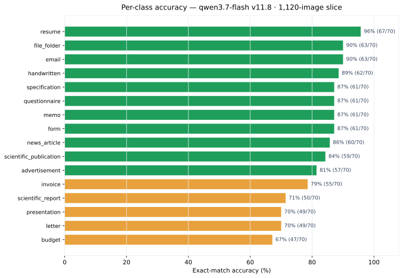

## The short version

The best slice accuracy is **99.4%** — prompt v11.8 on the 160-image balanced
set with `qwen3.7-flash`. On the largest held-out slice, **1,120 images spanning
three dataset splits**, v11.8 holds **82.6%** (925/1,120) with a **0% failure
rate** and a 36.9% near-miss share among its 195 misses.

## The accuracy arc

Prompt engineering moved this project from a **72.9%** Gemini baseline to
**99.4%** on the reference slice — then the harder question became
generalization. The same prompt at 320 / 480 / 800 / 1,120 images lands at
87.2% / 89.1% / 83.1% / 82.6%. The drop is dataset difficulty, not prompt
regression: larger slices draw from the harder RVL-CDIP train split and add
cross-split variety.

| Dataset slice | Images | Best version | Accuracy |
|--------------:|-------:|--------------|---------:|
| fixed_size_sampled (v1) | 160 | v11.8 | **99.4%** |
| fixed_size_sampled (v3/v4) | 160 | v16 | 96.2% / 79.4% |
| fixed_size_sampled_v2 | 160 | v13 | 86.2% |
| fixed_size_sampled_320 | 320 | v11.8 | 87.2% |
| fixed_size_sampled_480 | 480 | v11.8 | 89.1% |
| rvl_cdip_800 | 800 | v11.8 | 83.1% |
| 1600_balanced_1120 | 1,120 | v11.8 | 82.6% |

The full per-run record lives in the [experiment log](experiment-log.qmd) and the
[experiment reports](experiment-reports.qmd).

## Per-class performance on the 1,120-image slice

v11.8 · `rvl_cdip_1600` · 70 images per class · 82.59% exact match (925/1,120).

| Class | Correct | Total | Accuracy |
|-------|--------:|------:|---------:|
| `resume` | 67 | 70 | 96% |
| `email` | 63 | 70 | 90% |
| `file_folder` | 63 | 70 | 90% |
| `handwritten` | 62 | 70 | 89% |
| `form` | 61 | 70 | 87% |
| `memo` | 61 | 70 | 87% |
| `questionnaire` | 61 | 70 | 87% |
| `specification` | 61 | 70 | 87% |
| `news_article` | 60 | 70 | 86% |
| `scientific_publication` | 59 | 70 | 84% |
| `advertisement` | 57 | 70 | 81% |
| `invoice` | 55 | 70 | 79% |
| `scientific_report` | 50 | 70 | 71% |
| `letter` | 49 | 70 | 70% |
| `presentation` | 49 | 70 | 70% |
| `budget` | 47 | 70 | 67% |

**The three weakest classes** are `budget` (67%), `letter` (70%) and
`presentation` (70%) — budget and letter also dominate the confusion story below.

## Where the misses go

195 misclassifications, 72 near-misses (the correct class was the model's
runner-up), 933/1,120 rows with a parsable runner-up. Fixing the near-miss
tie-breaks alone would push accuracy to roughly **89.0%**.

The recurring confusion pairs across every run:

- `letter` ↔ `memo` — the single largest confused pair (~8% of all misses)
- `budget` ↔ `invoice` — tabular financial layouts
- `specification` ↔ `form` — multi-column technical documents

Browse the full reasoning traces in the
[misclassification appendix](../appendix/misclassifications.qmd) — each trace
shows the model walking the 14-check cascade, naming its runner-up, and
committing to a (wrong) label.

## Failure rate and cost

- **Failure rate: 0.0%** on the 1,120-image run — the retry loop recovered every
  transient provider error, so accuracy is measured over the full slice.
- **Billed $0.4937** actual vs $0.6815 list-price expected (+27.5%), averaging
  $0.000441/image. Prompt caching explains the gap: ~7,570 of ~12,000 prompt
  tokens/row were cache hits billed at ~10% of input price.
- Extrapolated linearly: **$0.35** for 800 images, **$11.02** for 25,000, and
  **$141.07** for a 320,000-image production sweep.

See [cost analysis](../cost/cost-estimation.qmd) for per-model pricing.

## Honest caveats

The 160-image slice scores look flattering and are best read as a
prompt-development signal. The per-class counts are tiny (10 images), and the
v3/v4 disjoint slices (same prompt family) scored 96.2% / 79.4% — a reminder
that 160-image numbers carry real variance. Trust the 800/1,120 rows for claims
about production behavior.

## Next moves (from the run analysis)

1. **Fix the 72 near-misses** — sharpen tie-break rules between the top confused
   pairs (highest leverage, up to ~6.4pp).
2. **Revisit `budget`/`letter`** — the two classes whose low accuracy drives most
   of the miss budget.
3. **Read the reasoning traces** before the next prompt iteration — the raw
   reasoning exposes the exact rule each miss tripped on.
